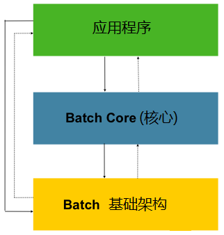

# Spring Batch架构

Spring Batch 设计时充分考虑了可扩展性和各种各样的终端用户。下图显示了Spring Batch的分层架构示意图,这种架构支撑了终端用户开发者的可扩展性和易用性

图1.1: Spring Batch 分层架构

Spring Batch分层架构主要分为三大高级组件:应用程序(Application), 核心层(Core) 和基础架构(Infrastructure)。应用程序包含开发人员使用Spring batch写的所有批处理作业和自定义代码。 批处理核心(Batch Core) 包含加载和控制批处理作业所必需的核心运行时类。

包括一个 **JobLauncher**, **Job**, 和 **Step** 的实现. 应用程序(Application) 与 核心(Core)都构建在通用基础架构之上. 基础架构包括通用的 readers 和 writers, 以及 services (如 **RetryTemplate**), 他们被应用程序开发者( **ItemReader** 和 **ItemWriter** ) 和核心框架自身(retry) 所使用.

