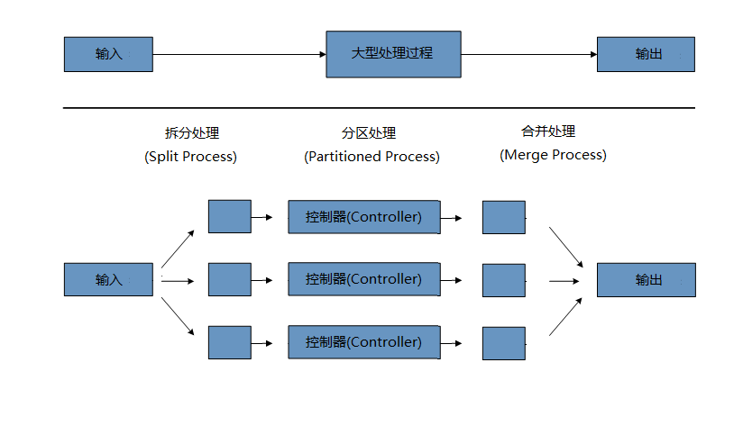

# 批处理策略

为了辅助批处理系统的设计和实现、应该通过结构示意图和代码实例的形式为设计师和程序员提供基础的批处理程序构建模块和以及处理模式.
在设计批处理Job时,应该将业务逻辑分解成一系列的步骤,使每个步骤都可以利用以下的标准构建模块来实现:

- 转换程序(Conversion Applications): 由外部系统提供或需要写入到外部系统的各种类型的文件,我们都需要为其创建一个转换程序, 用来将所提供的事务记录转换成符合要求的标准格式.这种类型的批处理程序可以部分或全部由转换工具模块组成(translation utility modules)(参见 Basic Batch Services,基本批处理服务).
- 验证程序(Validation Applications): 验证程序确保所有输入/输出记录都是正确和一致的.验证通常基于文件头和结尾信息, 校验和(checksums)以及记录级别的交叉验证算法.
- 提取程序(Extract Applications): 这种程序从数据库或输入文件读取一堆记录,根据预定义的规则选取记录,并将选取的记录写入到输出文件.
- 提取/更新程序(Extract/Update Applications): 这种程序从数据库或输入文件读取记录,并将输入的每条记录都更新到数据库,或记录到输出文件.
- 处理和更新程序(Processing and Updating Applications): 这种程序对从 提取或验证程序 传过来的输入事务记录进行处理.这些处理通常包括 从数据库读取数据,有可能更新数据库,并创建输出记录.
- 输出/格式化程序(Output/Format Applications): 这种程序从输入文件中读取信息,将数据重组成为标准格式,并打印到输出文件,或者传输给另一个程序或系统.

因为业务逻辑不能用上面介绍的这些标准模块来完成, 所以还需要另外提供一个基本的程序外壳(application shell).

除了这些主要的模块,每个应用还可以使用一到多个标准的实用程序环节(standard utility steps),如:

- Sort 排序,排序程序从输入文件读取记录,并根据记录中的某个key字段重新排序,然后生成输出文件. 排序通常由标准的系统实用程序来执行.
- Split 拆分,拆分程序从单个输入文件中读取记录,根据某个字段的值,将记录写入到不同的输出文件中. 拆分可以自定义或者由参数驱动的(parameter-driven)系统实用程序来执行.
- Merge 合并,合并程序从多个输入文件读取记录,并将组合后的数据写入到单个输出文件中. 合并可以自定义或者由参数驱动的(parameter-driven)系统实用程序来执行.

批处理程序也可以根据输入来源分类:

- 数据库驱动(Database-driven)的应用程序, 由从数据库中获取的行或值驱动.
- 文件驱动(File-driven)的应用程序,是由从文件中获取的值或记录驱动的.
- 消息驱动(Message-driven)的应用程序由从消息队列中检索到的消息驱动.

所有批处理系统的基础都是处理策略.影响策略选择的因素包括: 预估的批处理系统容量,  在线并发或与另一个批处理系统的并发量, 可用的批处理时间窗口(随着越来越多的企业想要全天候(7x24小时)运转,所以基本上没有明确的批处理窗口).

典型的批处理选项包括:

- 在一个批处理窗口中执行常规离线批处理
- 并发批处理/在线处理
- 同一时刻有许多不同的批处理(runs or jobs)在并行执行
- 分区(即同一时刻,有多个实例在处理同一个job)
- 上面这些的组合

上面列表中的顺序代表了批处理实现复杂性的排序,在同一个批处理窗口的处理最简单,而分区实现最复杂.

商业调度器可能支持上面的部分/或所有类型.

下面的部分将详细讨论这些处理选项.需要特别注意的是, 批处理所采用的提交和锁定策略将依赖于处理执行的类型,作为最佳实践,在线锁策略应该使用相同的原则.因此,在设计批处理整体架构时不能简单地拍脑袋决定(译注:即需要详细的论证和分析).

锁策略可以只使用普通的数据库锁,也可以在架构中实现自定义的锁服务.锁服务将跟踪数据库锁定(例如在一个专用的数据库表(db-table)中存储必要的信息),然后在应用程序请求数据库操作时授予权限或拒绝.重试逻辑也可以通过这种架构实现,以避免批处理作业因为资源锁定的情况而失败.

**1.在一个批处理窗口中的常规处理** 对于运行在一个单独批处理窗口中的简单批处理,更新的数据对在线用户或其他批处理来说并没有实时性要求,也没有并发问题,在批处理运行完成后执行单次提交即可.

大多数情况下,一种更健壮的方法会更合适.要记住的一件事是,批处理系统会随着时间的流逝而增长,包括复杂度和需要处理的数据量.如果没有合适的锁定策略,系统仍然依赖于一个单一的提交点,则修改批处理程序会是一件痛苦的事情.因此,即使是最简单的批处理系统,也应该为重启-恢复(restart-recovery)选项考虑提交逻辑,更不用说下面涉及到的那些更复杂情况下的信息.

**2.并发批处理/在线处理** 批处理程序处理的数据如果会同时被在线用户更新,就不应该锁定在线用户需要的所有任何数据(不管是数据库还是文件),即使只需要锁定几秒钟的时间.还应该每处理一批事务就提交一次数据库.这减少了其他程序不可用的数据,也压缩了数据不可用的时间.

减少物理锁的另一个选择是实现一个行级的逻辑锁,通过使用乐观锁模式或悲观锁模式.

- 乐观锁假设记录争用的可能性很低.这通常意味着并发批处理和在线处理所使用的每个数据表中都有一个时间戳列.当程序读取一行进行处理时,同时也获得对应的时间戳.当程序处理完该行以后尝试更新时,在update操作的WHERE子句中使用原来的时间戳作为条件.如果时间戳相匹配,则数据和时间戳都更新成功.如果时间戳不匹配,这表明在本程序上次获取和此次更新这段时间内已经有另一个程序修改了同一条记录,因此更新不会被执行.

- 悲观锁定策略假设记录争用的可能性很高,因此在检索时需要获得一个物理锁或逻辑锁.有一种悲观逻辑锁在数据表中使用一个专用的lock-column列.当程序想要为更新目的而获取一行时,它在lock column上设置一个标志.如果为某一行设置了标志位,其他程序在试图获取同一行时将会逻辑上获取失败.当设置标志的程序更新该行时,它也同时清除标志位,允许其他程序获取该行.请注意,在初步获取和初次设置标志位这段时间内必须维护数据的完整性,比如使用数据库锁(eg., SELECT FOR UPDATE).还请注意,这种方法和物理锁都有相同的缺点,除了它在构建一个超时机制时比较容易管理,比如记录而用户去吃午餐了,则超时时间到了以后锁会被自动释放.

这些模式并不一定适用于批处理,但他们可以被用在并发批处理和在线处理的情况下(例如,数据库不支持行级锁).作为一般规则,乐观锁更适合于在线应用,而悲观锁更适合于批处理应用.只要使用了逻辑锁,那么所有访问逻辑锁保护的数据的程序都必须采用同样的方案.

请注意,这两种解决方案都只锁定(address locking)单条记录.但很多情况下我们需要锁定一组相关的记录.如果使用物理锁,你必须非常小心地管理这些以避免潜在的死锁.如果使用逻辑锁,通常最好的解决办法是创建一个逻辑锁管理器,使管理器能理解你想要保护的逻辑记录分组(groups),并确保连贯和没有死锁(non-deadlocking).这种逻辑锁管理器通常使用其私有的表来进行锁管理、争用报告、超时机制 等等.

**3.并行处理** 并行处理允许多个批处理运行(run,名词,大意为运行中的程序)/任务(job)同时并行地运行,以使批处理总运行时间降到最低.如果多个任务不使用同一个文件、数据表、索引空间时这并不算什么问题.如果确实存在共享和竞争,那么这个服务就应该使用分区数据来实现.另一种选择是使用控制表来构建一个架构模块以维护他们之间的相互依赖关系.控制表应该为每个共享资源分配一行记录,不管这些资源是否被某个程序所使用.执行并行作业的批处理架构或程序随后将查询这个控制表,以确定是否可以访问所需的资源.

如果解决了数据访问的问题,并行处理就可以通过使用额外的线程来并行实现.在传统的大型主机环境中,并行作业类上通常被用来确保所有进程都有充足的CPU时间.无论如何,解决方案必须足够强劲,以确保所有正在运行的进程都有足够的时间片.

并行处理的其他关键问题还包括负载平衡以及一般系统资源的可用性(如文件、数据库缓冲池等).还要注意控制表自身也可能很容易变成一个至关重要的资源(即可能发生严重竞争?).

**4.分区(Partitioning)** 分区技术允许多版本的大型批处理程序并发地(concurrently)运行. 这样做的目的是减少超长批处理作业过程所需的时间. 可以成功分区的过程主要是那些可以拆分的输入文件 和/或 主要的数据库表被分区以允许程序使用不同的数据来运行.

此外,被分区的过程必须设计为只处理分配给他的数据集. 分区架构与数据库设计和数据库分区策略是密切相关的. 请注意,数据库分区并不一定指数据库需要在物理上实现分区,尽管在大多数情况下这是明智的.下面的图片展示了分区的方法:

系统架构应该足够灵活,以允许动态配置分区的数量. 自动控制和用户配置都应该纳入考虑范围. 自动配置可以根据参数来决定,例如输入文件大小 和/或 输入记录的数量.

**4.1分区方法** 下面列出了一些可能的分区方法. 选择哪种分区方法要根据具体情况来决定.

*1.使用固定值来分解记录集*

这涉及到将输入的记录集合分解成偶数个部分(例如10份,这样每部分是整个数据集的十分之一). 每个部分稍后由一个批处理/提取程序实例来处理.

为了使用这种方法,需要在预处理时将记录集拆分. 拆分的结果有一个最大值和最小值位置, 这两个值可以用作限制每个 批处理/提取程序处理部分的输入.

预处理可能是一个很大的开销,因为它必须计算并确定的每部分数据集的边界.

*2.根据关键列(Key Column)分解*

这涉及到将输入记录按照某个关键列来分解,比如定位码(location code),并将每个键分配给一个批处理实例.为了达到这个目标,也可以使用列值.

*3.根据分区表决定分配给哪一个批处理实例(详情见下文).*

*4.根据值的一部分决定分配给哪个批处理实例的值(例如值 0000-0999、1000-1999 等)*

在使用第1种方法时, 新值的添加将意味着需要手动重新配置批处理/提取程序,以确保新值被添加到某个特定的实例.

在使用第2种方法时,将确保所有的值都会被某个批处理作业实例处理到. 然而,一个实例处理的值的数量依赖于列值的分布(即可能存在大量的值分布在0000-0999范围内,而在1000-1999范围内的值却很少).如果使用这种方法,设计时应该考虑到数据范围的切分.

在这两种方法中,并不能将指定给批处理实例的记录实现最佳均匀分布. 批处理实例的数量并不能动态配置.

*5.根据视图来分解*

这种方法基本上是根据键列来分解,但不同的是在数据库级进行分解.它涉及到将记录集分解成视图.这些视图将被批处理程序的各个实例在处理时使用. 分解将通过数据分组来完成.

使用这个方法时,批处理的每个实例都必须为其配置一个特定的视图(而非主表).当然,对于新添加的数据,这个新的数据分组必须被包含在某个视图中.也没有自动配置功能,实例数量的变化将导致视图需要进行相应的改变.

*6.附加的处理指示器*

这涉及到输入表一个附加的新列,它充当一个指示器. 在预处理阶段,所有指示器都被标志为未处理. 在批处理程序获取记录阶段,只会读取被标记为未处理的记录,一旦他们被读取(并加锁),它们就被标记为正在处理状态. 当记录处理完成,指示器将被更新为完成或错误.批处理程序的多个实例不需要改变就可以开始,因为附加列确保每条纪录只被处理一次.

使用该选项时,表上的I/O会动态地增长.在批量更新的程序中,这种影响被降低了,因为写操作是必定要进行的.

*7.将表提取到平面文件*

这包括将表中的数据提取到一个文件中. 然后可以将这个文件拆分成多个部分,作为批处理实例的输入.

使用这个选项时,将数据提取到文件中,并将文件拆分的额外开销,有可能抵消多分区处理(multi-partitioning)的效果.可以通过改变文件分割脚本来实现动态配置.

*8.使用哈希列(Hashing Column)*

这个计划需要在数据库表中增加一个哈希列(key/index)来检索驱动(driver)记录. 这个哈希列将有一个指示器来确定将由批处理程序的哪个实例处理某个特定的行.例如,如果启动了三个批处理实例,那么“A”指示器将标记某行由实例1来处理,“B”将标记着将由实例2来处理,以此类推.

稍后用于检索记录的过程(procedure,程序)将有一个额外的WHERE子句来选择以一个特定指标标记的所有行. 这个表的insert需要附加的标记字段,默认值将是其中的某一个实例(例如“A”).

一个简单的批处理程序将被用来更新不同实例之间的重新分配负载的指标.当添加足够多的新行时,这个批处理会被运行(在任何时间,除了在批处理窗口中)以将新行分配给其他实例.

批处理应用程序的其他实例只需要像上面这样的批处理程序运行着以重新分配指标,以决定新实例的数量.

** 4.2数据库和应用程序设计原则 **

如果一个支持多分区(multi-partitioned)的应用程序架构,基于数据库采用关键列(key column)分区方法拆成的多个表,则应该包含一个中心分区仓库来存储分区参数.这种方式提供了灵活性,并保证了可维护性.这个中心仓库通常只由单个表组成,叫做分区表.

存储在分区表中的信息应该是是静态的,并且只能由DBA维护.每个多分区程序对应的单个分区有一行记录,组成这个表.这个表应该包含这些列: 程序ID编号,分区编号(分区的逻辑ID),一个分区对应的关键列（keycolumn）的最小值,分区对应的关键列的最大值.

在程序启动时,应用程序架构(Control Processing Tasklet,控制处理微线程)应该将程序id和分区号传递给该程序.这些变量被用于读取分区表,来确定应用程序应该处理的数据范围(如果使用关键列的话).另外分区号必须在整个处理过程中用来:

- 为了使合并程序正常工作,需要将分区号添加到输出文件/数据库更新
- 向框架的错误处理程序报告正常处理批处理日志和执行期间发生的所有错误

** 4.3 尽可能杜绝死锁**

当程序并行或分区运行时,会导致数据库资源的争用,还可能会发生死锁(Deadlocks).其中的关键是数据库设计团队在进行数据库设计时必须考虑尽可能消除潜在的竞争情况.

还要确保设计数据库表的索引时考虑到性能以及死锁预防.

死锁或热点往往发生在管理或架构表上,如日志表、控制表, 锁表(lock tables).这些影响也应该纳入考虑.为了确定架构可能的瓶颈,一个真实的压力测试是至关重要的.

要最小化数据冲突的影响,架构应该提供一些服务,如附加到数据库或遇到死锁时的 等待-重试(wait-and-retry)间隔时间.这意味着要有一个内置的机制来处理数据库返回码,而不是立即引发错误处理,需要等待一个预定的时间并重试执行数据库操作.

** 4.4参数传递和校验 ** 

对程序开发人员来说,分区架构应该相对透明.框架以分区模式运行时应该执行的相关任务包括:

- 在程序启动之前获取分区参数
- 在程序启动之前验证分区参数
- 在启动时将参数传递给应用程序

验证(validation)要包含必要的检查,以确保:

- 应用程序已经足够涵盖整个数据的分区
- 在各个分区之间没有遗漏断代(gaps)

如果数据库是分区的,可能需要一些额外的验证来保证单个分区不会跨越数据库的片区.

体系架构应该考虑整合分区(partitions).包括以下关键问题:

- 在进入下一个任务步骤之前是否所有的分区都必须完成?
- 如果一个分区Job中止了要怎么处理?