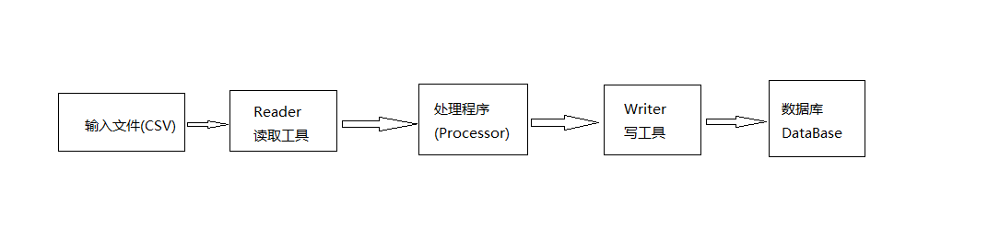
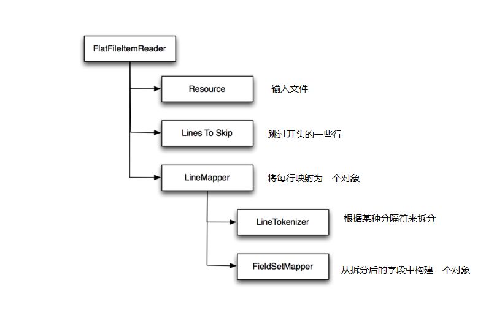
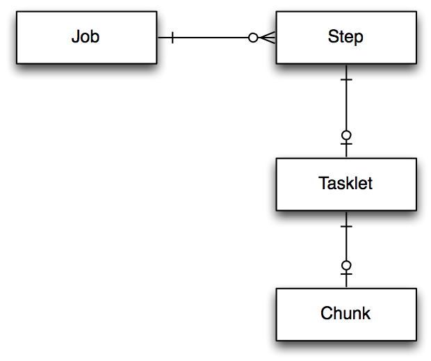

# Spring Batch示例: 读取CSV文件并写入MySQL数据库 #

原文链接: [Reading and writing CVS files with Spring Batch and MySQL](http://www.javaworld.com/article/2458888/spring-framework/open-source-java-projects-spring-batch.html)

原文作者: [Steven Haines - 技术架构师](http://www.javaworld.com/author/Steven-Haines/)

下载本教程的源代码: 
[SpringBatch-CSV演示代码][osjp-spring-batch-example.zip]

用批处理程序来操作动辄上GB的数据很可能会拖死整个系统,但现在我们可以通过Spring Batch将其拆解为多个小块(chunk)。Spring框架中的 Spring Batch 模块, 是专门设计了用来对各种类型文件进行批处理的工程。 本文先从一个简单的作业(Job)入手 —— 将从CSV文件中读取产品列表,并导入到MySQL数据库中; 然后我们一起研究 Spring Batch 的批处理特性: 如单/多处理单元(processors), 以及多个微线程(tasklets); 最后简单介绍一下 Spring Batch 提供的用来处理 忽略记录(skipping), 重试记录(retrying),以及批处理作业重启(restarting ) 的弹性工具(resiliency tools)。

如果你曾在Java企业系统中用批处理来处理过十万级以上的数据, 那么你肯定知道工作负载是怎么回事。 批处理系统需要处理大量的数据, 内部消化单条记录失败的情况, 还要管理中断,在重启后也不去重复执行已经处理过的部分。

对于初学者来说,下面是一些需要用到批处理的场景, 在这些情况下如果使用Spring Batch ,则会节省大量的时间:

- 接收的文件中缺少了一部分汇总信息,需要读取并解析整个文件,调用服务来获取缺少的那部分信息,然后写入输出文件,供另一个批处理程序使用。
- 如果在执行代码时发生错误,则将失败信息写入数据库中。 有一个专门的程序每隔15分钟来遍历一次失败信息,如果标记为可以重试,则完成后再重复执行一次。
- 在工作流中,约定由其他系统在收到消息事件时,来调用某个特定的服务。 但如果其他系统没有调用这个服务,那么一段时间后需要自动清理过期数据,以免影响正常的业务流程。
- 每天收到员工信息更新文件,需要为新员工建立相关档案和账号(artifacts)。
- 生成自定义订单的服务。 每天晚上需要执行批处理程序来生成清单文件,并将它们发送给相应的供应商。

## 作业与分块: Spring Batch 范例 ##

Spring Batch 有很多组成部分,我们先来看批量作业中的核心部分。 可以将一个作业分成以下3个步骤:

1. 读取数据
2. 对数据进行各种处理
3. 对数据进行写操作

例如, 打开一个CSV格式的数据文件,对文件中的数据执行某种处理,然后将数据写入数据库。 在Spring Batch中,  需要配置一个 **reader**  来读取文件中的数据(每次一行),  然后将数据传递给 **processor** 进行处理, 处理完成之后会将结果收集并分组为 “块 chunks” , 然后把这些记录发送给 **writer** ,在这里是插入到数据库中。 如图1所示。

**图1 Spring Batch批处理的基本逻辑**

Spring Batch 提供了常见输入源的 reader 实现, 极大地简化了批处理过程. 例如 CSV文件, XML文件、数据库、文件中的JSON记录,甚至是 JMS; 同样也实现了对应的 writer。 如有需要,创建自定义的 reader 和 writer 也很简单。

下载本教程的源代码: 
[SpringBatch-CSV演示代码][osjp-spring-batch-example.zip]

首先,让我们配置一个 file reader 来读取 CSV文件,将其内容映射到一个对象中,并将生成的对象插入数据库中。

## 读取并处理CVS文件 ##

Spring Batch 的内置 reader,  `org.springframework.batch.item.file.FlatFileItemReader`,用来将文件解析为多个独立的行。 需要纯文本文件的引用,文件开头要忽略的行数(比如标题,表头等信息), 以及将单行转换为对象的 `line mapper`. 行映射器需要一个分割字符串的分词器(line tokenizer),用来将一行拆分成多个组成字段, 还需要一个 field set mapper ,根据字段值构建对象。  `FlatFileItemReader` 的配置如下所示:

> **清单1 一个Spring Batch 配置文件**

    <bean id="productReader" class="org.springframework.batch.item.file.FlatFileItemReader" scope="step">

        <!-- <property name="resource" value="file:./sample.csv" /> -->
        <property name="resource" value="file:#{jobParameters['inputFile']}" />

        <property name="linesToSkip" value="1" />

        <property name="lineMapper">
            <bean class="org.springframework.batch.item.file.mapping.DefaultLineMapper">

                <property name="lineTokenizer">
                    <bean class="org.springframework.batch.item.file.transform.DelimitedLineTokenizer">
                        <property name="names" value="id,name,description,quantity" />
                    </bean>
                </property>

                <property name="fieldSetMapper">
                    <bean class="com.geekcap.javaworld.springbatchexample.simple.reader.ProductFieldSetMapper" />
                </property>
            </bean>
        </property>
    </bean>

下面来看看这些组件。 图2概括了它们之间的关系:

**图2 FlatFileItemReader的组件**

**Resources:**  `resource` 属性指定了要读取的文件。 注释部分的 resource 使用了文件的相对路径,也就是批处理作业工作目录下的 `sample.csv` 。 有趣的是使用了Job参数 `InputFile` : 使用*job parameters* 则允许在运行时才根据需要决定相关参数。 在使用 import 文件的情况下, 在运行时才决定使用哪个参数比起在编译时就固定要灵活好用很多。 (要一遍又一遍,五六七八遍导入同一个文件是相当无聊的!)

**Lines to skip:**  属性`linesToSkip` 告诉 file reader 有多少标题行需要跳过。 通常CSV文件的第一行包含标题信息,如列名称,所以本例中让 reader 跳过文件的第一行。

**Line mapper:**   `lineMapper` 负责将一行记录转换为一个对象。 依赖两个组件:

- `LineTokenizer` 指定了如何将一行拆分为多个字段。 本例中列出了CSV文件中各列的列名。
- `fieldSetMapper` 根据字段值构造一个对象。 示例中构建了一个  `Product` 对象, 属性包括  id, name, description, 以及 quantity 。

请注意,虽然Spring Batch提供了基础框架, 但我们仍需要设置字段映射的逻辑。 清单2显示了 *Product* 对象的源码,也就是我们准备构建的对象。

> **清单2 Product.java**

	package com.geekcap.javaworld.springbatchexample.simple.model;

	/**
	 * 代表产品的简单值对象(POJO)
	 */
	public class Product
	{
	    private int id;
	    private String name;
	    private String description;
	    private int quantity;

	    public Product() {
	    }

	    public Product(int id, String name, String description, int quantity) {
		this.id = id;
		this.name = name;
		this.description = description;
		this.quantity = quantity;
	    }

	    public int getId() {
		return id;
	    }

	    public void setId(int id) {
		this.id = id;
	    }

	    public String getName() {
		return name;
	    }

	    public void setName(String name) {
		this.name = name;
	    }

	    public String getDescription() {
		return description;
	    }

	    public void setDescription(String description) {
		this.description = description;
	    }

	    public int getQuantity() {
		return quantity;
	    }

	    public void setQuantity(int quantity) {
		this.quantity = quantity;
	    }
	}

Product 类是一个简单的POJO,包含4个字段。 清单3显示了 `ProductFieldSetMapper` 类的源代码。

> **清单3 ProductFieldSetMapper.java**

	package com.geekcap.javaworld.springbatchexample.simple.reader;
	
	import com.geekcap.javaworld.springbatchexample.simple.model.Product;
	import org.springframework.batch.item.file.mapping.FieldSetMapper;
	import org.springframework.batch.item.file.transform.FieldSet;
	import org.springframework.validation.BindException;
	
	/**
	 * 根据 CSV 文件中的字段集合构建  Product 对象
	 */
	public class ProductFieldSetMapper implements FieldSetMapper<Product>
	{
	    @Override
	    public Product mapFieldSet(FieldSet fieldSet) throws BindException {
	        Product product = new Product();
	        product.setId( fieldSet.readInt( "id" ) );
	        product.setName( fieldSet.readString( "name" ) );
	        product.setDescription( fieldSet.readString( "description" ) );
	        product.setQuantity( fieldSet.readInt( "quantity" ) );
	        return product;
	    }
	}

`ProductFieldSetMapper` 类实现了 `FieldSetMapper` 接口 ,该接口只定义了一个方法: `mapFieldSet()`.  只要 line mapper 将一行数据解析为单独的字段, 就会构建一个 `FieldSet`（包含命名好的字段), 然后将这个 `FieldSet` 对象传递给 `mapFieldSet()` 方法。 该方法负责创建对象来表示 CSV文件中的一行。 在本例中,我们通过 `FieldSet` 的各种 `read` 方法 构建一个 `Product` 实例.

## 写入数据库 ##

在读取文件得到一组 `Product` 之后 ,下一步就是将其写入到数据库。 原则上我们可以组装一个 processing  step,用来对这些数据进行某些业务处理,为简单起见,我们直接将数据写到数据库中。 清单4是 **ProductItemWriter** 类的源码。

> **清单4 `ProductItemWriter.java`**

	package com.geekcap.javaworld.springbatchexample.simple.writer;
	
	import com.geekcap.javaworld.springbatchexample.simple.model.Product;
	import org.springframework.batch.item.ItemWriter;
	import org.springframework.beans.factory.annotation.Autowired;
	import org.springframework.jdbc.core.JdbcTemplate;
	import org.springframework.jdbc.core.RowMapper;
	
	import java.sql.ResultSet;
	import java.sql.SQLException;
	import java.util.List;
	
	/**
	 * Writes products to a database
	 */
	public class ProductItemWriter implements ItemWriter<Product>
	{
	    private static final String GET_PRODUCT = "select * from PRODUCT where id = ?";
	    private static final String INSERT_PRODUCT = "insert into PRODUCT (id,name,description,quantity) values (?,?,?,?)";
	    private static final String UPDATE_PRODUCT = "update PRODUCT set name = ?, description = ?,quantity = ? where id = ?";
	
	    @Autowired
	    private JdbcTemplate jdbcTemplate;
	
	    @Override
	    public void write(List<? extends Product> products) throws Exception
	    {
	        for( Product product : products )
	        {
	            List<Product> productList = jdbcTemplate.query(GET_PRODUCT, new Object[] {product.getId()}, new RowMapper<Product>() {
	                @Override
	                public Product mapRow( ResultSet resultSet, int rowNum ) throws SQLException {
	                    Product p = new Product();
	                    p.setId( resultSet.getInt( 1 ) );
	                    p.setName( resultSet.getString( 2 ) );
	                    p.setDescription( resultSet.getString( 3 ) );
	                    p.setQuantity( resultSet.getInt( 4 ) );
	                    return p;
	                }
	            });
	
	            if( productList.size() > 0 )
	            {
	                jdbcTemplate.update( UPDATE_PRODUCT, product.getName(), product.getDescription(), product.getQuantity(), product.getId() );
	            }
	            else
	            {
	                jdbcTemplate.update( INSERT_PRODUCT, product.getId(), product.getName(), product.getDescription(), product.getQuantity() );
	            }
	        }
	    }
	}

`ProductItemWriter` 类实现了  `ItemWriter` 接口, 该接口只有一个方法: `write()`.  方法`write()` 接受一个 **list**, 这里是 `List<? extends Product> products` . Spring Batch 使用一种称为 “chunking” 的策略来实现 **writer** ,  chunking 的意思就是在读取时是一次读取一条数据, 但写入时是将一组数据一起执行的。 在job配置中,可以(通过 `commit-interval`)来控制每次想要一起写的item的数量。 在上面的例子中, `write()` 方法做了这些事:

1. 执行一条 **SELECT** 语句来根据指定的 `id` 获取 `Product`. 
2. 如果 `SELECT` 取得一条记录, 则 `write()` 中更新数据库中对应记录的值.
3. 如果 `SELECT` 没有查询结果, 则 `write()` 执行 `INSERT` 将产品信息添加到数据库中.

**ProductItemWriter** 类使用了Spring的 `JdbcTemplate`  类,这是在  `applicationContext.xml` 文件中定义的, 通过自动装配机制注入到 **ProductItemWriter**  中。 如果你没有用过 Jdbctemplate ,可以把它理解为是对 JDBC 接口的一个封装. 与数据库进行交互的 [模板设计模式](http://java.dzone.com/articles/design-patterns-template-method) 的实现. 代码应该很容易理解, 如果想了解更多信息, 请查看 [SpringJdbcTemplate 的 javadoc](http://docs.spring.io/spring/docs/current/javadoc-api/org/springframework/jdbc/core/JdbcTemplate.html)。

## 用 application context 将上下文组装起来 ##

到目前为止我们创建了 `Product`  领域对象类,  一个映射器类 `ProductFieldSetMapper` , 用来将CSV文件中的一行转换为一个对象,  以及 `ProductItemWriter` 类, 用来将对象写入数据库。 下面我们需要配置 Spring Batch 来将这些组件组装起来。  清单5 显示了  `applicationContext.xml` 文件的源代码,  里面定义了我们需要的bean。

> **清单 5. `applicationContext.xml`**

	<?xml version="1.0" encoding="UTF-8"?>
	<beans xmlns="http://www.springframework.org/schema/beans"
	       xmlns:xsi="http://www.w3.org/2001/XMLSchema-instance"
	       xmlns:context="http://www.springframework.org/schema/context"
	       xmlns:batch="http://www.springframework.org/schema/batch"
	       xmlns:jdbc="http://www.springframework.org/schema/jdbc"
	       xsi:schemaLocation="http://www.springframework.org/schema/beans http://www.springframework.org/schema/beans/spring-beans.xsd
	                http://www.springframework.org/schema/context http://www.springframework.org/schema/context/spring-context.xsd
	                http://www.springframework.org/schema/batch http://www.springframework.org/schema/batch/spring-batch.xsd
	                http://www.springframework.org/schema/jdbc http://www.springframework.org/schema/jdbc/spring-jdbc.xsd">
	
	
	    <context:annotation-config />
	
	    <!-- Component scan to find all Spring components -->
	    <context:component-scan base-package="com.geekcap.javaworld.springbatchexample" />
	
	
	    <!-- Data source - connect to a MySQL instance running on the local machine -->
	    <bean id="dataSource" class="org.apache.commons.dbcp.BasicDataSource" destroy-method="close">
	        <property name="driverClassName" value="com.mysql.jdbc.Driver"/>
	        <property name="url" value="jdbc:mysql://localhost/spring_batch_example"/>
	        <property name="username" value="sbe"/>
	        <property name="password" value="sbe"/>
	    </bean>
	
	    <bean id="transactionManager" class="org.springframework.jdbc.datasource.DataSourceTransactionManager">
	        <property name="dataSource" ref="dataSource" />
	    </bean>
	
	    <bean id="jdbcTemplate" class="org.springframework.jdbc.core.JdbcTemplate">
	        <property name="dataSource" ref="dataSource" />
	    </bean>
	
	    <!-- Create job-meta tables automatically -->
	    <jdbc:initialize-database data-source="dataSource">
	        <jdbc:script location="org/springframework/batch/core/schema-drop-mysql.sql" />
	        <jdbc:script location="org/springframework/batch/core/schema-mysql.sql" />
	    </jdbc:initialize-database>
	
	
	    <!-- Job Repository: used to persist the state of the batch job -->
	    <bean id="jobRepository" class="org.springframework.batch.core.repository.support.MapJobRepositoryFactoryBean">
	        <property name="transactionManager" ref="transactionManager" />
	    </bean>
	
	
	    <!-- Job Launcher: creates the job and the job state before launching it -->
	    <bean id="jobLauncher" class="org.springframework.batch.core.launch.support.SimpleJobLauncher">
	        <property name="jobRepository" ref="jobRepository" />
	    </bean>
	
	
	    <!-- Reader bean for our simple CSV example -->
	    <bean id="productReader" class="org.springframework.batch.item.file.FlatFileItemReader" scope="step">
	
	        <!-- <property name="resource" value="file:./sample.csv" /> -->
	        <property name="resource" value="file:#{jobParameters['inputFile']}" />
	
	
	        <!-- Skip the first line of the file because this is the header that defines the fields -->
	        <property name="linesToSkip" value="1" />
	
	        <!-- Defines how we map lines to objects -->
	        <property name="lineMapper">
	            <bean class="org.springframework.batch.item.file.mapping.DefaultLineMapper">
	
	                <!-- The lineTokenizer divides individual lines up into units of work -->
	                <property name="lineTokenizer">
	                    <bean class="org.springframework.batch.item.file.transform.DelimitedLineTokenizer">
	
	                        <!-- Names of the CSV columns -->
	                        <property name="names" value="id,name,description,quantity" />
	                    </bean>
	                </property>
	
	                <!-- The fieldSetMapper maps a line in the file to a Product object -->
	                <property name="fieldSetMapper">
	                    <bean class="com.geekcap.javaworld.springbatchexample.simple.reader.ProductFieldSetMapper" />
	                </property>
	            </bean>
	        </property>
	    </bean>
	
	    <bean id="productWriter" class="com.geekcap.javaworld.springbatchexample.simple.writer.ProductItemWriter" />
	
	</beans>

将 job 配置从 application/environment 中分离出来，使我们能够在环境迁移时不需要再重新定义一个 job。 清单5中定义了下面这些bean:

- `dataSource` : 示例程序需要连接到MySQL,所以连接池也就配置为连接到一个名为 `spring_batch_example` 的MySQL数据库，地址为本机(localhost),具体设置请参见下文。

- `transactionManager` : Spring事务管理器, 用于管理MySQL事务。

- `jdbcTemplate` : 该类提供了与JDBC 连接交互的模板设计模式实现。 这是一个用来简化数据库操作的辅助类,。 在实际的项目中一般会使用某种ORM工具, 例如Hibernate,上面再包装一个服务层, 但为了简单,那就先这样了。

- `jobRepository` : `MapJobRepositoryFactoryBean` 是 Spring Batch 用来管理 job 状态的组件。 在这里它使用前面配置的 `jdbctemplate` 将 job 信息储存到MySQL数据库中。

- `jobLauncher` : 该组件用来启动和管理 Spring Batch 作业的工作流,。

- `productReader` : 在job中这个 bean 负责执行读操作。

- `productWriter` : 这个bean 负责将 `Product` 实例写入数据库。

请注意, `jdbc:initialize-database` 节点指向了两个用来创建所需数据库表的Spring Batch 脚本。 这些脚本文件位于 Spring Batch core 的JAR文件中(由Maven自动引入了)对应的路径下。 JAR文件中包含了对应多个数据库的脚本, 比如MySQL、Oracle、SQL Server,等等。 这些脚本负责在运行 job 时创建需要的schema。 在本示例中,它删除(drop)表,然后再创建(create)表, 你可以试着运行一下。 如果在生产环境中, 你应该将SQL文件提取出来,然后手动执行 —— 毕竟生产环境一般创建了就不会删除。

> <u><h5>Spring Batch 中的 Lazy scope</h5></u>
>
> 你可能注意到 `productReader` 的 `scope` 属性值为“`step`”。 **step scope** 是Spring框架中的一种作用域, 主要用于 Spring Batch。 它本质上是一种 *lazy scope*, Spring在首次访问时才创建这种 bean。 在本例中, 我们需要使用 step scope 是因为使用了 job 参数中的 "`InputFile`" 值, 这个值在应用启动时是不存在的。在 Spring Batch 中使用 step scope 使得在 Bean创建时能收到 "`InputFile`" 值。

## 定义job ##

清单6显示了 `file-import-job.xml` 文件, 该文件定义了实际的 job

> **清单6 `file-import-job.xml`**

	<?xml version="1.0" encoding="UTF-8"?>
	<beans xmlns="http://www.springframework.org/schema/beans"
	       xmlns:xsi="http://www.w3.org/2001/XMLSchema-instance"
	       xmlns:context="http://www.springframework.org/schema/context"
	       xmlns:batch="http://www.springframework.org/schema/batch"
	       xsi:schemaLocation="http://www.springframework.org/schema/beans http://www.springframework.org/schema/beans/spring-beans.xsd
	                http://www.springframework.org/schema/context http://www.springframework.org/schema/context/spring-context.xsd
	                http://www.springframework.org/schema/batch http://www.springframework.org/schema/batch/spring-batch.xsd">
	
	
	    <!-- Import our beans -->
	    <import resource="classpath:/applicationContext.xml" />
	
	    <job id="simpleFileImportJob" xmlns="http://www.springframework.org/schema/batch">
	        <step id="importFileStep">
	            <tasklet>
	                <chunk reader="productReader" writer="productWriter" commit-interval="5" />
	            </tasklet>
	        </step>
	    </job>
	
	</beans>

请注意, 一个 `job` 可以包含 **0到多个** step; 一个 `step` 可以有 **0/1** 个 tasklet; 一个 `tasklet` 可以有 **0/1** 个 `chunk`, 如图3所示。

>**图3 job, step, tasklet 和 chunk 关系**

示例中, `simpleFileImportJob` 包含一个名为 `importFileStep` 的 step。 `importFileStep` 包含一个未命名的 tasklet, 而tasklet中有一个 chunk。 chunk 引用了 `productReader` 和 `productWriter` 。 同时指定 **commit-interval** 值为 `5` . 意思是每次最多传递给 writer 的记录数是5条。 该 step 使用 `productReader` 读取5条产品记录，然后将这些记录传递给 `productWriter` 写出。 chunk 一直重复执行, 直到所有数据都处理完成。

清单6 还还引入了 `applicationContext.xml` 文件,该文件包含所有需要的bean。 而 Job 通常在单独的文件中定义; 这是因为 job 加载器在执行时需要一个 job 文件以及对应的 job name。 虽然可以把所有的东西揉进一个文件中, 但很快会变得臃肿和难以维护,所以一般约定, 一个 job 定义在一个文件中, 同时引入其他依赖文件。

最后,你可能会注意到,job 节点 上定义了XML名称空间( `xmlns` ) 。 这样做是为了不想在每个节点上加上前缀 "`batch:`"。  在某个节点上定义的 namespace 会作用于该节点和所有子节点。

## 构建并运行项目 ##

清单7显示了构建此项目的POM文件的内容

> **清单7 `pom.xml`**

	<project xmlns="http://maven.apache.org/POM/4.0.0" xmlns:xsi="http://www.w3.org/2001/XMLSchema-instance"
	  xsi:schemaLocation="http://maven.apache.org/POM/4.0.0 http://maven.apache.org/xsd/maven-4.0.0.xsd">
	  <modelVersion>4.0.0</modelVersion>
	
	  <groupId>com.geekcap.javaworld</groupId>
	  <artifactId>spring-batch-example</artifactId>
	  <version>1.0-SNAPSHOT</version>
	  <packaging>jar</packaging>
	
	  <name>spring-batch-example</name>
	  <url>http://maven.apache.org</url>

    <properties>
        <project.build.sourceEncoding>UTF-8</project.build.sourceEncoding>
        <spring.version>3.2.1.RELEASE</spring.version>
        <spring.batch.version>2.2.1.RELEASE</spring.batch.version>
        <java.version>1.6</java.version>
    </properties>

    <dependencies>
        <!-- Spring Dependencies -->
        <dependency>
            <groupId>org.springframework</groupId>
            <artifactId>spring-context</artifactId>
            <version>${spring.version}</version>
        </dependency>
        <dependency>
            <groupId>org.springframework</groupId>
            <artifactId>spring-core</artifactId>
            <version>${spring.version}</version>
        </dependency>
        <dependency>
            <groupId>org.springframework</groupId>
            <artifactId>spring-beans</artifactId>
            <version>${spring.version}</version>
        </dependency>
        <dependency>
            <groupId>org.springframework</groupId>
            <artifactId>spring-jdbc</artifactId>
            <version>${spring.version}</version>
        </dependency>
        <dependency>
            <groupId>org.springframework</groupId>
            <artifactId>spring-tx</artifactId>
            <version>${spring.version}</version>
        </dependency>
        <dependency>
            <groupId>org.springframework.batch</groupId>
            <artifactId>spring-batch-core</artifactId>
            <version>${spring.batch.version}</version>
        </dependency>
        <dependency>
            <groupId>org.springframework.batch</groupId>
            <artifactId>spring-batch-infrastructure</artifactId>
            <version>${spring.batch.version}</version>
        </dependency>

        <!-- Apache DBCP-->
        <dependency>
            <groupId>commons-dbcp</groupId>
            <artifactId>commons-dbcp</artifactId>
            <version>1.4</version>
        </dependency>

        <!-- MySQL -->
        <dependency>
            <groupId>mysql</groupId>
            <artifactId>mysql-connector-java</artifactId>
            <version>5.1.27</version>
        </dependency>

        <!-- Testing -->
        <dependency>
            <groupId>junit</groupId>
            <artifactId>junit</artifactId>
            <version>4.11</version>
            <scope>test</scope>
        </dependency>
    </dependencies>

    <build>
        <plugins>
            <plugin>
                <groupId>org.apache.maven.plugins</groupId>
                <artifactId>maven-compiler-plugin</artifactId>
                <configuration>
                    <source>${java.version}</source>
                    <target>${java.version}</target>
                </configuration>
            </plugin>
            <plugin>
                <groupId>org.apache.maven.plugins</groupId>
                <artifactId>maven-jar-plugin</artifactId>
                <configuration>
                    <archive>
                        <manifest>
                            <addClasspath>true</addClasspath>
                            <classpathPrefix>lib/</classpathPrefix>
                        </manifest>
                    </archive>
                </configuration>
            </plugin>
            <plugin>
                <groupId>org.apache.maven.plugins</groupId>
                <artifactId>maven-dependency-plugin</artifactId>
                <executions>
                    <execution>
                        <id>copy</id>
                        <phase>install</phase>
                        <goals>
                            <goal>copy-dependencies</goal>
                        </goals>
                        <configuration>
                            <outputDirectory>${project.build.directory}/lib</outputDirectory>
                        </configuration>
                    </execution>
                </executions>
            </plugin>
        </plugins>
        <finalName>spring-batch-example</finalName>
    </build>

	</project>

上面的POM文件引入了 Spring context, core, beans,tx 和 JDBC 这些依赖库， 还引入了 Spring Batch core 以及 infrastructure 依赖(包)。 这些依赖组合起来就是 Spring 和 Spring Batch 的基础。 当然也引入了 Apache DBCP 数据库连接池和MySQL驱动。  `plug-in` 部分指定了使用Java 1.6进行编译,并在 build 时将所有依赖项库复制到 lib 目录下。 

可以使用下面的命令来构建项目:

	mvn clean install

## Spring Batch 连接数据库 ##

现在 job 已经组装好了, 如果想在生产环境中运行还需要将Spring Batch 连到数据库。 Spring Batch 需要有一些表来记录 job 的当前状态和已经处理过的 record 表。 这样,假若某个 job 确实需要重启, 就可以从上次断开的地方继续执行。

Spring Batch 可以连接到多个数据库, 但为了演示, 所以使用MySQL。 请 [下载MySQL](http://www.mysql.com/) 并安装后再执行下面的脚本。 社区版是免费的,而且能满足大多数需要。 请根据你的操作系统选择合适的版本下载安装. 然后可能需要手动启动MySQL(Windows 一般自动启动)。

安装好MySQL后还需要创建数据库以及相应的用户(并赋予权限)。 启动命令行并进入MySQL的bin目录启动 mysql 客户端，连接服务器后执行以下SQL命令(请注意,在Linux下可能需要使用 `root` 用户执行 `mysql` 客户端程序, 或者使用 `sudo` 进行权限切换.

	create database spring_batch_example;
	create user 'sbe'@'localhost' identified by 'sbe';
	grant all on spring_batch_example.* to 'sbe'@'localhost';

第一行SQL创建名为 `spring_batch_example` 的数据库(database), 这个库用来保存产品数据。 第二行创建名为 `sbe` 的用户, Spring Batch Example的缩写,也可以使用其他名字,只要配置得一致就行), 密码也指定为 `sbe`。 最后一行将 `spring_batch_example` 数据库上的所有权限赋予 `sbe ` 用户。

接下来,使用下面的命令创建 **PRODUCT** 表:

	CREATE TABLE PRODUCT (
		ID INT NOT NULL,
		NAME VARCHAR(128) NOT NULL,
		DESCRIPTION VARCHAR(128),
		QUANTITY INT,
		PRIMARY KEY(ID)
	);

接着,我们在项目的 target 目录下创建一个文件 `sample.csv`, 并填充一些数据(用英文逗号分隔):

	id,name,description,quantity
	1,Product One,This is product 1, 10
	2,Product Two,This is product 2, 20
	3,Product Three,This is product 3, 30
	4,Product Four,This is product 4, 20
	5,Product Five,This is product 5, 10
	6,Product Six,This is product 6, 50
	7,Product Seven,This is product 7, 80
	8,Product Eight,This is product 8, 90

在Linux中可以使用下面的命令启动 batch job，其中的CLASSPATH 分隔符是英文冒号:

	java -cp spring-batch-example.jar:./lib/* org.springframework.batch.core.launch.support.CommandLineJobRunner classpath:/jobs/file-import-job.xml simpleFileImportJob inputFile=sample.csv

当然,如果操作系统是windows，因为使用英文分号作为 CLASSPATH 分隔符,所以需要有一点改变:

	java -cp spring-batch-example.jar;./lib/* org.springframework.batch.core.launch.support.CommandLineJobRunner classpath:/jobs/file-import-job.xml simpleFileImportJob inputFile=sample.csv

`CommandLineJobRunner` 是 Spring Batch 框架中执行 job 的类。 它需要定义了 job的XML文件名, 以及需要执行的job名字, 还可以传入其他自定义参数。 因为 `file-import-job.xml` 被打包在JAR文件中, 所以可以通过: `classpath:/jobs/file-import-job.xml` 来访问。 我们需要执行的 Job 名称 为: `simpleFileImportJob` , 还传入一个参数 `InputFile`, 值为 `sample.csv`。

如果执行不出错, 输出结果类似于下面这样:

	Nov 12, 2013 4:09:17 PM org.springframework.context.support.AbstractApplicationContext prepareRefresh
	INFO: Refreshing org.springframework.context.support.ClassPathXmlApplicationContext@6b4da8f4: startup date [Tue Nov 12 16:09:17 EST 2013]; root of context hierarchy
	Nov 12, 2013 4:09:17 PM org.springframework.beans.factory.xml.XmlBeanDefinitionReader loadBeanDefinitions
	INFO: Loading XML bean definitions from class path resource [jobs/file-import-job.xml]
	Nov 12, 2013 4:09:18 PM org.springframework.beans.factory.xml.XmlBeanDefinitionReader loadBeanDefinitions
	INFO: Loading XML bean definitions from class path resource [applicationContext.xml]
	Nov 12, 2013 4:09:19 PM org.springframework.beans.factory.support.DefaultListableBeanFactory registerBeanDefinition
	INFO: Overriding bean definition for bean 'simpleFileImportJob': replacing [Generic bean: class [org.springframework.batch.core.configuration.xml.SimpleFlowFactoryBean]; scope=; abstract=false; lazyInit=false; autowireMode=0; dependencyCheck=0; autowireCandidate=true; primary=false; factoryBeanName=null; factoryMethodName=null; initMethodName=null; destroyMethodName=null] with [Generic bean: class [org.springframework.batch.core.configuration.xml.JobParserJobFactoryBean]; scope=; abstract=false; lazyInit=false; autowireMode=0; dependencyCheck=0; autowireCandidate=true; primary=false; factoryBeanName=null; factoryMethodName=null; initMethodName=null; destroyMethodName=null]
	Nov 12, 2013 4:09:19 PM org.springframework.beans.factory.support.DefaultListableBeanFactory registerBeanDefinition
	INFO: Overriding bean definition for bean 'productReader': replacing [Generic bean: class [org.springframework.batch.item.file.FlatFileItemReader]; scope=step; abstract=false; lazyInit=false; autowireMode=0; dependencyCheck=0; autowireCandidate=false; primary=false; factoryBeanName=null; factoryMethodName=null; initMethodName=null; destroyMethodName=null; defined in class path resource [applicationContext.xml]] with [Root bean: class [org.springframework.aop.scope.ScopedProxyFactoryBean]; scope=; abstract=false; lazyInit=false; autowireMode=0; dependencyCheck=0; autowireCandidate=true; primary=false; factoryBeanName=null; factoryMethodName=null; initMethodName=null; destroyMethodName=null; defined in BeanDefinition defined in class path resource [applicationContext.xml]]
	Nov 12, 2013 4:09:19 PM org.springframework.beans.factory.support.DefaultListableBeanFactory preInstantiateSingletons
	INFO: Pre-instantiating singletons in org.springframework.beans.factory.support.DefaultListableBeanFactory@6aba4211: defining beans [org.springframework.context.annotation.internalConfigurationAnnotationProcessor,org.springframework.context.annotation.internalAutowiredAnnotationProcessor,org.springframework.context.annotation.internalRequiredAnnotationProcessor,org.springframework.context.annotation.internalCommonAnnotationProcessor,dataSource,transactionManager,jdbcTemplate,jobRepository,jobLauncher,productReader,productWriter,org.springframework.batch.core.scope.internalStepScope,org.springframework.beans.factory.config.CustomEditorConfigurer,org.springframework.batch.core.configuration.xml.CoreNamespacePostProcessor,importFileStep,simpleFileImportJob,org.springframework.context.annotation.ConfigurationClassPostProcessor.importAwareProcessor,scopedTarget.productReader]; root of factory hierarchy
	Nov 12, 2013 4:09:19 PM org.springframework.batch.core.launch.support.SimpleJobLauncher afterPropertiesSet
	INFO: No TaskExecutor has been set, defaulting to synchronous executor.
	Nov 12, 2013 4:09:22 PM org.springframework.batch.core.launch.support.SimpleJobLauncher$1 run
	INFO: Job: [FlowJob: [name=simpleFileImportJob]] launched with the following parameters: [{inputFile=sample.csv}]
	Nov 12, 2013 4:09:22 PM org.springframework.batch.core.job.SimpleStepHandler handleStep
	INFO: Executing step: [importFileStep]
	Nov 12, 2013 4:09:22 PM org.springframework.batch.core.launch.support.SimpleJobLauncher$1 run
	INFO: Job: [FlowJob: [name=simpleFileImportJob]] completed with the following parameters: [{inputFile=sample.csv}] and the following status: [COMPLETED]
	Nov 12, 2013 4:09:22 PM org.springframework.context.support.AbstractApplicationContext doClose
	INFO: Closing org.springframework.context.support.ClassPathXmlApplicationContext@6b4da8f4: startup date [Tue Nov 12 16:09:17 EST 2013]; root of context hierarchy
	Nov 12, 2013 4:09:22 PM org.springframework.beans.factory.support.DefaultSingletonBeanRegistry destroySingletons
	INFO: Destroying singletons in org.springframework.beans.factory.support.DefaultListableBeanFactory@6aba4211: defining beans [org.springframework.context.annotation.internalConfigurationAnnotationProcessor,org.springframework.context.annotation.internalAutowiredAnnotationProcessor,org.springframework.context.annotation.internalRequiredAnnotationProcessor,org.springframework.context.annotation.internalCommonAnnotationProcessor,dataSource,transactionManager,jdbcTemplate,jobRepository,jobLauncher,productReader,productWriter,org.springframework.batch.core.scope.internalStepScope,org.springframework.beans.factory.config.CustomEditorConfigurer,org.springframework.batch.core.configuration.xml.CoreNamespacePostProcessor,importFileStep,simpleFileImportJob,org.springframework.context.annotation.ConfigurationClassPostProcessor.importAwareProcessor,scopedTarget.productReader]; root of factory hierarchy

然后到数据库中校对一下 **PRODUCT** 表中是否正确保存了我们在 csv 文件中指定的那几条记录(示例是8条)。

## 使用 Spring Batch 执行批量处理 ##

到这一步, 示例程序从CSV文件中读取数据,并将信息保存到了数据库中。 虽然可以运行起来, 但有时候想要对数据进行转换或者过滤某些数据,然后再插入到数据库中。 在本节中,我们将创建一个简单的 processor , 并不覆盖原有的 product 数量,而是先从数据库中查询现有记录, 然后将CSV文件中对应的数量增加到 product 中, 然后再写入数据库。

清单8显示了 **ProductItemProcessor** 类的源码。

> **清单8 `ProductItemProcessor.java`**

	package com.geekcap.javaworld.springbatchexample.simple.processor;
	
	import com.geekcap.javaworld.springbatchexample.simple.model.Product;
	import org.springframework.batch.item.ItemProcessor;
	import org.springframework.beans.factory.annotation.Autowired;
	import org.springframework.jdbc.core.JdbcTemplate;
	import org.springframework.jdbc.core.RowMapper;
	
	import java.sql.ResultSet;
	import java.sql.SQLException;
	import java.util.List;
	
	/**
	 * Processor that finds existing products and updates a product quantity appropriately
	 */
	public class ProductItemProcessor implements ItemProcessor<Product,Product>
	{
	    private static final String GET_PRODUCT = "select * from PRODUCT where id = ?";
	    @Autowired
	    private JdbcTemplate jdbcTemplate;
	
	    @Override
	    public Product process(Product product) throws Exception
	    {
	        // Retrieve the product from the database
	        List<Product> productList = jdbcTemplate.query(GET_PRODUCT, new Object[] {product.getId()}, new RowMapper<Product>() {
	            @Override
	            public Product mapRow( ResultSet resultSet, int rowNum ) throws SQLException {
	                Product p = new Product();
	                p.setId( resultSet.getInt( 1 ) );
	                p.setName( resultSet.getString( 2 ) );
	                p.setDescription( resultSet.getString( 3 ) );
	                p.setQuantity( resultSet.getInt( 4 ) );
	                return p;
	            }
	        });
	
	        if( productList.size() > 0 )
	        {
	            // Add the new quantity to the existing quantity
	            Product existingProduct = productList.get( 0 );
	            product.setQuantity( existingProduct.getQuantity() + product.getQuantity() );
	        }
	
	        // Return the (possibly) update prduct
	        return product;
	    }
	}

`ProductItemProcessor` 实现了 `ItemProcessor<I,O>` 接口, 其中类型 **I** 表示传递给处理器的对象类型, 而 **O** 则表示处理器返回的对象类型。 在本例中,我们传入的是 `Product` 对象,返回的也是 `Product` 对象。 **ItemProcessor** 接口只定义了一个方法: `process()` , 在里面我们根据给定的 `id` 执行一条 **SELECT** 语句从数据库中查询对应的 `Product` 。 如果找到 `Product`对象 ,则将该对象的数量加上新的数量。

processor 没有做任何过滤, 如果 `process()` 方法返回 `null`, 则Spring Batch 将会忽略这个 item, 不将其发送给 writer.

将 processor 组装到 job 中很简单。 首先,添加一个新的bean 到 `applicationContext.xml` 中:

	<bean id="productProcessor" class="com.geekcap.javaworld.springbatchexample.simple.processor.ProductItemProcessor" />

接下来,在 `chunk` 中通过 `processor` 属性来引用这个 bean:

    <job id="simpleFileImportJob" xmlns="http://www.springframework.org/schema/batch">
        <step id="importFileStep">
            <tasklet>
                <chunk reader="productReader" processor="productProcessor" writer="productWriter" commit-interval="5" />
            </tasklet>
        </step>
    </job>

编译并执行 job, 如果不出错, 每执行一次都可以在数据库中看到产品数量发生了变化。

## 创建多个processors ##

前面我们定义了单个处理器, 但有时候可能想要以适当的粒度来创建多个 item processor，然后在同一个 chunk 中按顺序执行. 例如, 可能需要一个过滤器来忽略数据库中不存在的记录,还需要一个 processor 来正确地管理 item 数量。 这时可以使用Spring Batch 的 `CompositeItemProcessor` 来大显身手. 使用步骤如下:

1. 创建 processor 类
2. 在applicationContext.xml中配置各个 bean
3. 定义一个类型为 `org.springframework.batch.item.support.CompositeItemProcessor` 的 bean,然后将其 `delegates` 设置为需要执行的处理器bean 的 list
4. 让 `chunk` 的 `processor` 属性指向 `CompositeItemProcessor`

假设有一个 `ProductFilterProcessor` , 则可以像下面这样指定 process :

	<bean id="productFilterProcessor" class="com.geekcap.javaworld.springbatchexample.simple.processor.ProductFilterItemProcessor" />
	
	<bean id="productProcessor" class="com.geekcap.javaworld.springbatchexample.simple.processor.ProductItemProcessor" />
	
	<bean id="productCompositeProcessor" class="org.springframework.batch.item.support.CompositeItemProcessor">
		<property name="delegates">
			<list>
				<ref bean="productFilterProcessor" />
				<ref bean="productProcessor" />
			</list>
		</property>
	</bean>

然后只需修改一下 job 配置即可,如下所示:

    <job id="simpleFileImportJob" xmlns="http://www.springframework.org/schema/batch">
        <step id="importFileStep">
            <tasklet>
                <chunk reader="productReader" processor="productCompositeProcessor" writer="productWriter" commit-interval="5" />
            </tasklet>
        </step>
    </job>

## Tasklets(微任务) ##

分块是一个非常好的作业拆分策略,用来将作业拆分成多块: 依次读取每一个 item , 执行处理, 然后将其按块写出。 但如果想执行某些只需要执行一次的线性操作该怎么办呢?  此时可以创建一个 `tasklet`。 `tasklet` 可以执行各种操作/需求! 例如, 可以从FTP站点下载文件, 解压/解密文件, 或者调用web服务来判断文件处理是否已经执行。 下面是创建 `tasklet`的基本过程:

1. 定义一个实现 `org.springframework.batch.core.step.tasklet.Tasklet` 接口的类。
2. 实现 `execute()` 方法。
3. 返回恰当的 `org.springframework.batch.repeat.RepeatStatus` 值: `CONTINUABLE` 或者是 `FINISHED`.
4. 在 `applicationContext.xml` 文件中定义对应的 bean。
5. 创建一个 `step`, 其中子元素 `tasklet` 引用第4步定义的bean。

清单9 显示了一个新的 tasklet 的源码, 将我们的输入文件拷贝到存档目录中。

> **清单9  `ArchiveProductImportFileTasklet.java`**

	package com.geekcap.javaworld.springbatchexample.simple.tasklet;
	
	import org.apache.commons.io.FileUtils;
	import org.springframework.batch.core.StepContribution;
	import org.springframework.batch.core.scope.context.ChunkContext;
	import org.springframework.batch.core.step.tasklet.Tasklet;
	import org.springframework.batch.repeat.RepeatStatus;
	
	import java.io.File;
	
	/**
	 * A tasklet that archives the input file
	 */
	public class ArchiveProductImportFileTasklet implements Tasklet
	{
	    private String inputFile;
	
	    @Override
	    public RepeatStatus execute(StepContribution stepContribution, ChunkContext chunkContext) throws Exception
	    {
	        // Make our destination directory and copy our input file to it
	        File archiveDir = new File( "archive" );
	        FileUtils.forceMkdir( archiveDir );
	        FileUtils.copyFileToDirectory( new File( inputFile ), archiveDir );
	
	        // We're done...
	        return RepeatStatus.FINISHED;
	    }
	
	    public String getInputFile() {
	        return inputFile;
	    }
	
	    public void setInputFile(String inputFile) {
	        this.inputFile = inputFile;
	    }
	}

**ArchiveProductImportFileTasklet** 类实现了 `Tasklet` 接口的 `execute()` 方法。 其中使用Apache Commons I/O 库的工具类 `FileUtils` 来创建一个新的 `archive` 目录,然后将input file 拷贝到里面。

将下面的 bean 定义添加到  `applicationContext.xml` 文件中:

    <bean id="archiveFileTasklet" class="com.geekcap.javaworld.springbatchexample.simple.tasklet.ArchiveProductImportFileTasklet" scope="step">
        <property name="inputFile" value="#{jobParameters['inputFile']}" />
    </bean>

请注意, 因为传入了一个名为 `inputFile` 的 job 参数,所以 这个bean 也设置了作用域范围 `scope="step"`, 以确保在 bean 对象创建时能取得需要的 job 参数。

清单10 显示了更新后的job.

> **清单10 `file-import-job.xml`**

	<?xml version="1.0" encoding="UTF-8"?>
	<beans xmlns="http://www.springframework.org/schema/beans"
	       xmlns:xsi="http://www.w3.org/2001/XMLSchema-instance"
	       xmlns:context="http://www.springframework.org/schema/context"
	       xmlns:batch="http://www.springframework.org/schema/batch"
	       xsi:schemaLocation="http://www.springframework.org/schema/beans http://www.springframework.org/schema/beans/spring-beans.xsd
	                http://www.springframework.org/schema/context http://www.springframework.org/schema/context/spring-context.xsd
	                http://www.springframework.org/schema/batch http://www.springframework.org/schema/batch/spring-batch.xsd">
	
	
	    <!-- Import our beans -->
	    <import resource="classpath:/applicationContext.xml" />
	
	    <job id="simpleFileImportJob" xmlns="http://www.springframework.org/schema/batch">
	        <step id="importFileStep" next="archiveFileStep">
	            <tasklet>
	                <chunk reader="productReader" processor="productProcessor" writer="productWriter" commit-interval="5" />
	            </tasklet>
	        </step>
	        <step id="archiveFileStep">
	            <tasklet ref="archiveFileTasklet" />
	        </step>
	    </job>
	
	</beans>

清单10中添加了一个id为 `archiveFileStep` 的step, , 然后在 `importFileStep` 中将 `"next"` 指向他。  `"next"` 参数可以用来控制 job 中 step 的执行流程。 虽然超出了本文所述的范围,但需要注意, 可以根据某个任务的执行结果状态来决定下面执行哪个 step[也就是 job分支,类似于 if,switch 什么的].   `archiveFileStep` 只包含上面创建的这个 `tasklet`。

## 弹性(Resiliency) ##

Spring Batch job resiliency提供了以下三个工具:

1. **Skip** : 如果处理过程中某条记录是错误的, 如CSV文件中格式不正确的行, 那么可以直接跳过该对象, 继续处理下一个。
2. **Retry** : 如果出现错误,而在几毫秒后再次执行就可能解决, 那么可以让 Spring Batch 对该元素重试一次/(或多次)。 例如, 你可能想要更新数据库中的某条记录, 但另一个查询把这条记录给锁了。 根据业务设计,这个锁将会很快释放, 那么重试可能就会成功。
3. **Restart** : 如果将 job 状态存储在数据库中, 而一旦它执行失败, 那么就可以选择重启 job 实例, 并继续上次执行的位置。

我们这里不会详细讲述每个 Resiliency 特征, 但我想总结一下可用的选项。

### Skipping Items(跳过某项) ###

有时你可能想要跳过某些记录, 比如 reader 读取的无效记录,或者处理/写入过程中出现异常的对象。 要跳过记录有两种方式:

- 在 `chunk` 元素上定义 `skip-limit` 属性, 告诉Spring 最多允许跳过多少个 items,超过则 job 失败(如果无效记录很少那可以接受,但如果无效记录太多,那可能输入数据就有问题了)。
- 定义一个 `skippable-exception-classes` 列表, 用来判断当前记录是否可以跳过, 可以指定 `include` 元素来决定发生哪些异常时会跳过当前记录, 还可以指定 `exclude` 元素来决定哪些异常不会触发 skip( 比如你想跳过某个异常层次父类, 但排除一或多个子类异常时)。

示例如下:

	<job id="simpleFileImportJob" xmlns="http://www.springframework.org/schema/batch">
        <step id="importFileStep">
            <tasklet>
                <chunk reader="productReader" processor="productProcessor" writer="productWriter" commit-interval="5" skip-limit="10">
			<skippable-exception-classes>
				<include class="org.springframework.batch.item.file.FlatFileParseException" />
			</skippable-exception-classes>
		</chunk>
            </tasklet>
        </step>
    </job>

这里在处理某条记录时如果抛出 `FlatFileParseException` 异常, 则这条记录将被跳过。 如果超过10次 skip, 那么直接让 job 失败。

### 重试（Retrying Items） ###

有时发生的异常是可以重试的, 如由于数据库锁导致的失败。 重试(Retry)的实现和跳过(Skip)非常相似:

- 在 `chunk` 元素上定义 `retry-limit` 属性, 告诉Spring 每个 item 最多允许重试多少次, 超过则认为该记录处理失败。 如果只用重试, 不指定跳过,则如果某条记录重试处理失败, 则 job将被标记为失败。
- 定义一个 `retryable-exception-classes` 列表, 用来判断当前记录是否可以重试; 可以指定 `include` 元素来决定哪些异常发生时当前记录可以重试, 还可以指定 `exclude` 元素来决定哪些异常不对当前记录重试执行.。

例如:

	<job id="simpleFileImportJob" xmlns="http://www.springframework.org/schema/batch">
	    <step id="importFileStep">
	        <tasklet>
	            <chunk reader="productReader" processor="productProcessor" writer="productWriter" commit-interval="5" retry-limit="5">
			<retryable-exception-classes>
				<include class="org.springframework.dao.OptimisticLockingFailureException" />
			</retryable-exception-classes>
		</chunk>
	        </tasklet>
	    </step>
	</job>

还可以将重试和可跳过的异常通过 skippable exception  与 retry exception 对应起来。 因此, 如果某个异常触发了5次重试, 5次重试之后还没搞定, 恰好该异常也在 skippable 列表中, 则这条记录将被跳过。 如果 exception 不在 skippable 列表则会让整个 job 失败。

### 重启 job ###

最后, 对于执行失败的 job作业, 我们可以重新启动,并让他们从上次断开的地方继续执行。 要做到这一点, 只需要使用和上次一模一样的参数来启动 job, 则 Spring Batch 会自动从数据库中找到这个实例然后继续执行。 你也可以拒绝重启, 或者通过参数控制 job 中一个 step 可以重启的次数(一般来说多次重试都失败了,则可能需要放弃处理了。)

## 总结 ##

批处理是某些业务需求最好的解决方案,  Spring batch 框架提供了实现批处理作业的整体架构。 Spring Batch 将分块模式分为三个阶段: 读取(read)、 处理(process)、 和写入(write),并支持常规资源的读取和写入。 本期的[Open source Java projects ](http://www.javaworld.com/blog/open-source-java-projects/) 系列探讨了 Spring Batch 是干什么的以及如何使用它。

我们先创建了一个简单的 job, 从CSV文件读取 Product 数据然后导入数据库, 接着添加 processor 来对 job 进行扩展: 用来管理 product 数量。 最后我们写了一个单独的 tasklet 来归档输入文件。 虽然示例中没有涉及, 但Spring Batch 的弹性特征是非常重要的, 所以简单介绍了Spring Batch提供的三大弹性工具: skipping records, retrying records, 和 restarting batch jobs。

本文只是简单介绍 Spring Batch 的皮毛, 但希望能让你对  Spring Batch 执行批处理作业有一定的了解和认识。

下载本教程的源代码: 
[SpringBatch-CSV演示代码][osjp-spring-batch-example.zip]

[osjp-spring-batch-example.zip]: https://github.com/cncounter/SpringBatchReferenceCN/raw/master/01_introduction/osjp-spring-batch-example.zip