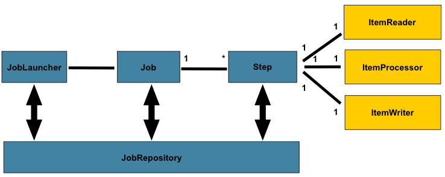
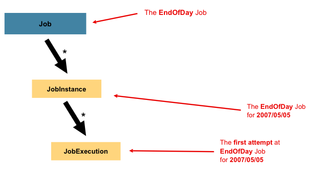
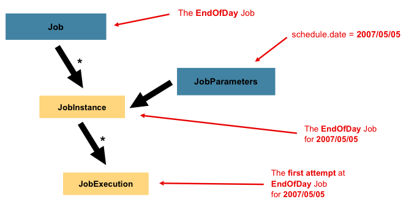
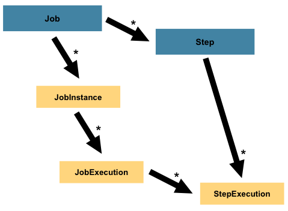

# 3. 批处理的域语言

对于有任何批处理操作经验的架构师来说，在Spring Batch中所使用的批处理的整体概念都会感到熟悉与舒适。其中有"Jobs"，"Steps"以及开发者所提供的被称为"ItemReader"和"ItemWriter"的批处理单元。另外，基于Spring的模式、操作、模板、回调和术语，还有着以下的方便性：

- 在分离关注点方面的显著增强
- 轮廓清晰的架构层次与作为接口提供服务
- 简单与默认的实现能够快速的上手以及能够容易使用框架以外的技术
- 显著增强的可扩展性

下面的关系图是一个已使用了数十年的批处理体系结构的简化版本，它提供了组成批处理操作域语言的各组件的概述。这个框架体系作为一个蓝图在最近几代平台上提供了数十种实现（COBOL/Mainframe, C++/Unix, 以及现在的Java/其他平台）。JCL和COBOL开发者同C++、C#和Java开发者一样熟悉这个概念。Spring Batch为此提供的层次、组件与技术服务的物理实现被验证是健壮的，作为基础服务与扩展服务通常被用于建立从简单到复杂的批处理应用，用来解决十分复杂的处理需求。

在上面的关系图中，所包含的高亮部分就是组成批处理域语言的关键概念。一个Job有多个Step，一个Step精确对应一个ItemReader、ItemProcessor、ItemWriter。一个Job需要被启动(JobLauncher)，当前运行中的流程需要被存储(JobRepository)。

## 3.1 Job

本节介绍了有关批处理任务的固有概念。一个 **Job** 作为一个实体，封装了整个批处理过程，同Spring其他的项目一样，**Job**经过xml配置文件或基于java的配置关联起来。此配置可能会被称为"job configuration"。但是，**Job** 也只是整个层次结构的顶层：

在Spring Batch中，**Job** 只是**Step**的容器，组合了一个流程中属于一个逻辑下的多个step，也能够进行针对所有step的全局属性配置，例如可重启配置。job的配置包括：

- job的简称
- Step的定义及执行顺序
- job是否是可重启的

Spring Batch提供了**SimpleJob**这样一个默认的简单job接口的实现形式，在job的顶层建立了标准功能，然而有时批处理的名空间概念需要直接实例化，这时就可以使用 `<job>` 标签：

	<job id="footballJob">
	    <step id="playerload" next="gameLoad"/>
	    <step id="gameLoad" next="playerSummarization"/>
	    <step id="playerSummarization"/>
	</job>

###3.1.1 JobInstance

JobInstance涉及到一个运行逻辑job的概念。让我们考虑一下，在一天结束时运行一次批处理任务，
类似上述图表中的"EndOfDay"任务。有一个统一的"EndOfDay"任务，但是job的每个独立运行都必须分开跟踪监控。在这个例子中，每天会有一个逻辑的JobInstance。例如，在1月1日运行一次，在1月2日运行一次。如果1月1日第一次运行失败了，第二天再运行一次，这仍然是1月1日的运行（通常也和处理的数据对应起来，意味着处理的是1月1日的数据等等）。因此，每个JobInstance能有多次执行(JobExection的更多详细信息将在下文讨论），而对应于在特定时间运行特定的Job和JobParameter只有一个JobInstance。

JobInstance的定义完全与加载的数据无关，数据的加载方式只与ItemReader的实现方式相关。例如在EndOfDay场景中，可能有一个名为"effective data"或是"schedule data"的数据列用来表示数据所属日期。因此，1月1日运行只会加载属于1日的数据，1月2日运行只会加载2日的数据。因为这更像是一个业务决定，所以留给ItemReader去处理。另外，使用相同的JobInstance可以决定是否使用前一次执行使用的状态(例如ExecutionContext，下文讨论)。使用新的JobInstance意味着“从头开始”，而使用存在的instance通常意味着"从离开的地方开始"。

### 3.1.2 JobParameters

讨论完JobInstance与Job之间的区别，自然要开始讨论“如何区分一个JobInstance与另一个JobInstance”。答案是：JobParameters。JobParamters是一组用来启动批处理任务的参数，他们被用于在运行过程中标记识别或是引用数据：

在上面的例子中一个job有两个实例，一个是1月1日以01-01-2008的参数启动运行，一个是1月2日以01-02-2008的参数启动运行。因此可以这样定义：JobInstance = Job + JobParameter。这让开发者有效地控制JobInstance，因为开发者可以有效控制输入给JobInstance的参数。

> **注意**：并非所有的job需要设定参数来对JobInstance进行标识，默认情况下应该设定参数，在该框架中也允许带有参数提交的job不做对JobInstance进行标识的处理工作。

### 3.1.3 JobExecution

一个JobExecution的概念是对于运行一次Job。一次执行可能成功也可能失败，但是只有这次执行完全成功后对应的JobInstance才会被认为是完成了。以之前的EndOfDay任务为例，01-01-2008第一次运行生成的JobInstance失败后，以相同的参数(01-01-2008)再次运行，一个新的JobExecution会被创建，但是仍然是同一个JobInstance。

Job定义了任务是什么以及如何启动，JobInstance是纯粹的组织对象用来执行操作组织在一起，主要目的是开启正确的重启语义，而JobExecution是运行过程中状态的主要存储机制，有着多得多的属性需要控制与持久化：

>**表3.1 JobExecution属性**

<table class="MsoNormalTable" border="1" cellspacing="1" cellpadding="0" width="694" style="width:416.2pt;mso-cellspacing:.7pt;background:white">
 <tbody><tr style="mso-yfti-irow:0;mso-yfti-firstrow:yes">
  <td style="padding:.75pt .75pt .75pt .75pt">
  
status<o:p></o:p>

  </td>
  <td width="569" style="width:341.55pt;padding:.75pt .75pt .75pt .75pt">
  
BatchStatus对象表示了执行状态。BatchStatus.STARTED表示运行时，BatchStatus.FAILED表示执行失败，BatchStatus.COMPLETED表示任务成功结束<o:p></o:p>

  </td>
 </tr>
 <tr style="mso-yfti-irow:1">
  <td style="padding:.75pt .75pt .75pt .75pt">
  
startTime<o:p></o:p>

  </td>
  <td width="569" style="width:341.55pt;padding:.75pt .75pt .75pt .75pt">
  
使用java.util.Date类表示任务开始时的系统时间<o:p></o:p>

  </td>
 </tr>
 <tr style="mso-yfti-irow:2">
  <td style="padding:.75pt .75pt .75pt .75pt">
  
endTime<o:p></o:p>

  </td>
  <td width="569" style="width:341.55pt;padding:.75pt .75pt .75pt .75pt">
  
使用java.util.Date类表示任务结束时的系统时间<o:p></o:p>

  </td>
 </tr>
 <tr style="mso-yfti-irow:3">
  <td style="padding:.75pt .75pt .75pt .75pt">
  
exitStatus<o:p></o:p>

  </td>
  <td width="569" style="width:341.55pt;padding:.75pt .75pt .75pt .75pt">
  
ExitStatus表示任务的运行结果。它是最重要的，因为它包含了返回给调用者的退出代码。更多详细信息参见第五章<o:p></o:p>

  </td>
 </tr>
 <tr style="mso-yfti-irow:4">
  <td style="padding:.75pt .75pt .75pt .75pt">
  
createTime<o:p></o:p>

  </td>
  <td width="569" style="width:341.55pt;padding:.75pt .75pt .75pt .75pt">
  
使用java.util.Date类表示JobExecution第一次持久化时的系统时间。这是框架管理任务的ExecutionContext所要求的，一个任务可能还没有启动(也就没有startTime)，但总是会有createTime<o:p></o:p>

  </td>
 </tr>
 <tr style="mso-yfti-irow:5">
  <td style="padding:.75pt .75pt .75pt .75pt">
  
lastUpdated<o:p></o:p>

  </td>
  <td width="569" style="width:341.55pt;padding:.75pt .75pt .75pt .75pt">
  
使用java.util.Date类表示最近一次JobExecution被持久化的系统时间<o:p></o:p>

  </td>
 </tr>
 <tr style="mso-yfti-irow:6">
  <td style="padding:.75pt .75pt .75pt .75pt">
  
executionContext<o:p></o:p>

  </td>
  <td width="569" style="width:341.55pt;padding:.75pt .75pt .75pt .75pt">
  
‘属性包'包含了运行过程中所有需要被持久化的用户数据。<o:p></o:p>

  </td>
 </tr>
 <tr style="mso-yfti-irow:7;mso-yfti-lastrow:yes">
  <td style="padding:.75pt .75pt .75pt .75pt">
  
failureException<o:p></o:p>

  </td>
  <td width="569" style="width:341.55pt;padding:.75pt .75pt .75pt .75pt">
  
在任务执行过程中例外的列表。在任务失败时有不止一个例外发生的情况下会很有用。<o:p></o:p>

  </td>
 </tr>
</tbody></table>

这些属性是很重要，将被持久化并用于判断任务执行的状态。例如，如果EndOfDay的任务在01-01的下午9点启动，在9:30时失败了，那么在批处理元数据表中会创建下面的记录：

> **表 3.2. BATCH_JOB_INSTANCE**

<table summary="BATCH_JOB_INSTANCE" style="border-collapse: collapse;border-top: 0.5pt solid ; border-bottom: 0.5pt solid ; border-left: 0.5pt solid ; border-right: 0.5pt solid ; "><colgroup><col><col></colgroup><tbody><tr><td style="border-right: 0.5pt solid ; border-bottom: 0.5pt solid ; ">JOB_INST_ID</td><td style="border-bottom: 0.5pt solid ; ">JOB_NAME</td></tr><tr><td style="border-right: 0.5pt solid ; ">1</td><td style="">EndOfDayJob</td></tr></tbody></table>

> **表 3.3. BATCH_JOB_EXECUTION_PARAMS**

<table summary="BATCH_JOB_EXECUTION_PARAMS" style="border-collapse: collapse;border-top: 0.5pt solid ; border-bottom: 0.5pt solid ; border-left: 0.5pt solid ; border-right: 0.5pt solid ; "><colgroup><col><col><col><col><col></colgroup><tbody><tr><td style="border-right: 0.5pt solid ; border-bottom: 0.5pt solid ; ">JOB_EXECUTION_ID</td><td style="border-right: 0.5pt solid ; border-bottom: 0.5pt solid ; ">TYPE_CD</td><td style="border-right: 0.5pt solid ; border-bottom: 0.5pt solid ; ">KEY_NAME</td><td style="border-right: 0.5pt solid ; border-bottom: 0.5pt solid ; ">DATE_VAL</td><td style="border-bottom: 0.5pt solid ; ">IDENTIFYING</td></tr><tr><td style="border-right: 0.5pt solid ; ">1</td><td style="border-right: 0.5pt solid ; ">DATE</td><td style="border-right: 0.5pt solid ; ">schedule.Date</td><td style="border-right: 0.5pt solid ; ">2008-01-01</td><td style="">TRUE</td></tr></tbody></table>

> **表 3.4. BATCH_JOB_EXECUTION**

<table summary="BATCH_JOB_EXECUTION" style="border-collapse: collapse;border-top: 0.5pt solid ; border-bottom: 0.5pt solid ; border-left: 0.5pt solid ; border-right: 0.5pt solid ; "><colgroup><col><col><col><col><col></colgroup><tbody><tr><td style="border-right: 0.5pt solid ; border-bottom: 0.5pt solid ; ">JOB_EXEC_ID</td><td style="border-right: 0.5pt solid ; border-bottom: 0.5pt solid ; ">JOB_INST_ID</td><td style="border-right: 0.5pt solid ; border-bottom: 0.5pt solid ; ">START_TIME</td><td style="border-right: 0.5pt solid ; border-bottom: 0.5pt solid ; ">END_TIME</td><td style="border-bottom: 0.5pt solid ; ">STATUS</td></tr><tr><td style="border-right: 0.5pt solid ; ">1</td><td style="border-right: 0.5pt solid ; ">1</td><td style="border-right: 0.5pt solid ; ">2008-01-01 21:00</td><td style="border-right: 0.5pt solid ; ">2008-01-01 21:30</td><td style="">FAILED</td></tr></tbody></table>

> **注意**:针对清晰度与格式设置，列的名称可能已经缩写或简化。

现在任务失败了，花费了一整夜解决问题，但是批处理开放时间已经过去了。假定批处理开放时间是下午9:00开始，那么01-01的任务会重新开始，到9:30结束。但是由于现在已经是第二天了，01-02的任务也必须在之后的9:31开始运行，正常运行一个小时候在10:30结束。除非两个job可能访问相同的数据，在数据库层面造成冲突锁，一般并不会要求一个JobInstance在另一个之后运行。一个Job什么时候能够运行完全是调度程序决定的，因此对于不同的JobInstance，Spring Batch并不会组织并发执行(如果一个JobInstance在运行时尝试同时运行相同的JobInstance则会抛出JobExecutionAlreadyRunningException例外)。此时JobInstance表和JobParameters表会增加一行数据，JobExecution表会增加两行数据：

> **表 3.5. BATCH_JOB_INSTANCE**

<table summary="BATCH_JOB_INSTANCE" style="border-collapse: collapse;border-top: 0.5pt solid ; border-bottom: 0.5pt solid ; border-left: 0.5pt solid ; border-right: 0.5pt solid ; "><colgroup><col><col></colgroup><tbody><tr><td style="border-right: 0.5pt solid ; border-bottom: 0.5pt solid ; ">JOB_INST_ID</td><td style="border-bottom: 0.5pt solid ; ">JOB_NAME</td></tr><tr><td style="border-right: 0.5pt solid ; border-bottom: 0.5pt solid ; ">1</td><td style="border-bottom: 0.5pt solid ; ">EndOfDayJob</td></tr><tr><td style="border-right: 0.5pt solid ; ">2</td><td style="">EndOfDayJob</td></tr></tbody></table>

> **表3.6. BATCH_JOB_EXECUTION_PARAMS**

<table summary="BATCH_JOB_EXECUTION_PARAMS" style="border-collapse: collapse;border-top: 0.5pt solid ; border-bottom: 0.5pt solid ; border-left: 0.5pt solid ; border-right: 0.5pt solid ; "><colgroup><col><col><col><col><col></colgroup><tbody><tr><td style="border-right: 0.5pt solid ; border-bottom: 0.5pt solid ; ">JOB_EXECUTION_ID</td><td style="border-right: 0.5pt solid ; border-bottom: 0.5pt solid ; ">TYPE_CD</td><td style="border-right: 0.5pt solid ; border-bottom: 0.5pt solid ; ">KEY_NAME</td><td style="border-right: 0.5pt solid ; border-bottom: 0.5pt solid ; ">DATE_VAL</td><td style="border-bottom: 0.5pt solid ; ">IDENTIFYING</td></tr><tr><td style="border-right: 0.5pt solid ; border-bottom: 0.5pt solid ; ">1</td><td style="border-right: 0.5pt solid ; border-bottom: 0.5pt solid ; ">DATE</td><td style="border-right: 0.5pt solid ; border-bottom: 0.5pt solid ; ">schedule.Date</td><td style="border-right: 0.5pt solid ; border-bottom: 0.5pt solid ; ">2008-01-01 00:00:00</td><td style="border-bottom: 0.5pt solid ; ">TRUE</td></tr><tr><td style="border-right: 0.5pt solid ; border-bottom: 0.5pt solid ; ">2</td><td style="border-right: 0.5pt solid ; border-bottom: 0.5pt solid ; ">DATE</td><td style="border-right: 0.5pt solid ; border-bottom: 0.5pt solid ; ">schedule.Date</td><td style="border-right: 0.5pt solid ; border-bottom: 0.5pt solid ; ">2008-01-01 00:00:00</td><td style="border-bottom: 0.5pt solid ; ">TRUE</td></tr><tr><td style="border-right: 0.5pt solid ; ">3</td><td style="border-right: 0.5pt solid ; ">DATE</td><td style="border-right: 0.5pt solid ; ">schedule.Date</td><td style="border-right: 0.5pt solid ; ">2008-01-02 00:00:00</td><td style="">TRUE</td></tr></tbody></table>

> **表3.7. BATCH_JOB_EXECUTION**

<table summary="BATCH_JOB_EXECUTION" style="border-collapse: collapse;border-top: 0.5pt solid ; border-bottom: 0.5pt solid ; border-left: 0.5pt solid ; border-right: 0.5pt solid ; "><colgroup><col><col><col><col><col></colgroup><tbody><tr><td style="border-right: 0.5pt solid ; border-bottom: 0.5pt solid ; ">JOB_EXEC_ID</td><td style="border-right: 0.5pt solid ; border-bottom: 0.5pt solid ; ">JOB_INST_ID</td><td style="border-right: 0.5pt solid ; border-bottom: 0.5pt solid ; ">START_TIME</td><td style="border-right: 0.5pt solid ; border-bottom: 0.5pt solid ; ">END_TIME</td><td style="border-bottom: 0.5pt solid ; ">STATUS</td></tr><tr><td style="border-right: 0.5pt solid ; border-bottom: 0.5pt solid ; ">1</td><td style="border-right: 0.5pt solid ; border-bottom: 0.5pt solid ; ">1</td><td style="border-right: 0.5pt solid ; border-bottom: 0.5pt solid ; ">2008-01-01 21:00</td><td style="border-right: 0.5pt solid ; border-bottom: 0.5pt solid ; ">2008-01-01 21:30</td><td style="border-bottom: 0.5pt solid ; ">FAILED</td></tr><tr><td style="border-right: 0.5pt solid ; border-bottom: 0.5pt solid ; ">2</td><td style="border-right: 0.5pt solid ; border-bottom: 0.5pt solid ; ">1</td><td style="border-right: 0.5pt solid ; border-bottom: 0.5pt solid ; ">2008-01-02 21:00</td><td style="border-right: 0.5pt solid ; border-bottom: 0.5pt solid ; ">2008-01-02 21:30</td><td style="border-bottom: 0.5pt solid ; ">COMPLETED</td></tr><tr><td style="border-right: 0.5pt solid ; ">3</td><td style="border-right: 0.5pt solid ; ">2</td><td style="border-right: 0.5pt solid ; ">2008-01-02 21:31</td><td style="border-right: 0.5pt solid ; ">2008-01-02 22:29</td><td style="">COMPLETED</td></tr></tbody></table>

> **注意**:针对清晰度与格式设置，列的名称可能已经缩写或简化。

## 3.2 Step

Step是一个域对象，它封装了批处理任务中的一个独立的连续阶段。因此每个job是由一个或是多个step组成的，step包含了定义以及控制一个实际运行中批处理任务所必须的所有信息。这个描述很含糊，是因为step中的内容完全是编写job的开发者所赋予的，step的复杂度完全依赖于开发者。一个简单的step可能只是从文件中加载数据到数据库，只需要几行代码(依赖于实现方式)。一个复杂的step可能作为整个业务处理的一部分而有着复杂的业务流程。像job那样，step有着自己的StepExecution并且对应于唯一一个JobExecution：

### 3.2.1 StepExecution

StepExecution表示需要执行一个step，和JobExecution类似，在每次运行step时会创建一个新的StepExecution。但是，如果一个Step之前的那个step执行失败导致这个step无法执行，则不会为这个step创建对应的StepExecution，因为StepExecution只会在step实际启动时创建。

Step的执行过程是由StepExecution类的对象所表示的，包括了每次执行所对应的step、JobExecution、相关的事务操作(例如提交与回滚)、开始时间结束时间等。此外每次执行step时还包含了一个ExecutionContext，用来存放开发者在批处理运行过程中所需要的任何信息，例如用来重启的静态数据与状态数据。下表列出了StepExecution的属性：

<table class="MsoNormalTable" border="1" cellspacing="1" cellpadding="0" width="694" style="width:416.2pt;mso-cellspacing:.7pt;background:white">
 <tbody><tr style="mso-yfti-irow:0;mso-yfti-firstrow:yes">
  <td style="padding:.75pt .75pt .75pt .75pt">
  
status<o:p></o:p>

  </td>
  <td width="563" style="width:338.05pt;padding:.75pt .75pt .75pt .75pt">
  
使用BatchStatus对象来表示执行状态。运行时，状态为BatchStatus.STARTED；运行失败状态为BatchStatus.FAILED；成功结束时状态为BatchStatus.COMPLETED<o:p></o:p>

  </td>
 </tr>
 <tr style="mso-yfti-irow:1">
  <td style="padding:.75pt .75pt .75pt .75pt">
  
startTime<o:p></o:p>

  </td>
  <td width="563" style="width:338.05pt;padding:.75pt .75pt .75pt .75pt">
  
执行开始时间，使用java.util.Date类表示<o:p></o:p>

  </td>
 </tr>
 <tr style="mso-yfti-irow:2">
  <td style="padding:.75pt .75pt .75pt .75pt">
  
endTime<o:p></o:p>

  </td>
  <td width="563" style="width:338.05pt;padding:.75pt .75pt .75pt .75pt">
  
执行结束时间(成功或失败)，使用java.util.Date类表示<o:p></o:p>

  </td>
 </tr>
 <tr style="mso-yfti-irow:3">
  <td style="padding:.75pt .75pt .75pt .75pt">
  
exitStatus<o:p></o:p>

  </td>
  <td width="563" style="width:338.05pt;padding:.75pt .75pt .75pt .75pt">
  
执行结果，使用ExitStatus表示。最重要的是它包含了返回给调用者的退出代码。更多详细信息参见第五章<o:p></o:p>

  </td>
 </tr>
 <tr style="mso-yfti-irow:4">
  <td style="padding:.75pt .75pt .75pt .75pt">
  
executionContext<o:p></o:p>

  </td>
  <td width="563" style="width:338.05pt;padding:.75pt .75pt .75pt .75pt">
  
包含了在执行过程中任何需要进行持久化的用户数据<o:p></o:p>

  </td>
 </tr>
 <tr style="mso-yfti-irow:5">
  <td style="padding:.75pt .75pt .75pt .75pt">
  
readCount<o:p></o:p>

  </td>
  <td width="563" style="width:338.05pt;padding:.75pt .75pt .75pt .75pt">
  
成功读取的记录数<o:p></o:p>

  </td>
 </tr>
 <tr style="mso-yfti-irow:6">
  <td style="padding:.75pt .75pt .75pt .75pt">
  
writeCount<o:p></o:p>

  </td>
  <td width="563" style="width:338.05pt;padding:.75pt .75pt .75pt .75pt">
  
成功写入的记录数<o:p></o:p>

  </td>
 </tr>
 <tr style="mso-yfti-irow:7">
  <td style="padding:.75pt .75pt .75pt .75pt">
  
commitCount<o:p></o:p>

  </td>
  <td width="563" style="width:338.05pt;padding:.75pt .75pt .75pt .75pt">
  
执行过程的事务中成功提交次数<o:p></o:p>

  </td>
 </tr>
 <tr style="mso-yfti-irow:8">
  <td style="padding:.75pt .75pt .75pt .75pt">
  
rollbackCount<o:p></o:p>

  </td>
  <td width="563" style="width:338.05pt;padding:.75pt .75pt .75pt .75pt">
  
执行过程的事务中回滚次数<o:p></o:p>

  </td>
 </tr>
 <tr style="mso-yfti-irow:9">
  <td style="padding:.75pt .75pt .75pt .75pt">
  
readSkipCount<o:p></o:p>

  </td>
  <td width="563" style="width:338.05pt;padding:.75pt .75pt .75pt .75pt">
  
因为读取失败而略过的记录数<o:p></o:p>

  </td>
 </tr>
 <tr style="mso-yfti-irow:10">
  <td style="padding:.75pt .75pt .75pt .75pt">
  
processSkipCount<o:p></o:p>

  </td>
  <td width="563" style="width:338.05pt;padding:.75pt .75pt .75pt .75pt">
  
因为处理失败而略过的记录数<o:p></o:p>

  </td>
 </tr>
 <tr style="mso-yfti-irow:11">
  <td style="padding:.75pt .75pt .75pt .75pt">
  
filterCount<o:p></o:p>

  </td>
  <td width="563" style="width:338.05pt;padding:.75pt .75pt .75pt .75pt">
  
被ItemProcessor过滤的记录数<o:p></o:p>

  </td>
 </tr>
 <tr style="mso-yfti-irow:12;mso-yfti-lastrow:yes">
  <td style="padding:.75pt .75pt .75pt .75pt">
  
writerSkipCount<o:p></o:p>

  </td>
  <td width="563" style="width:338.05pt;padding:.75pt .75pt .75pt .75pt">
  
因为写入失败而略过的记录数<o:p></o:p>

  </td>
 </tr>
</tbody></table>

## 3.3 ExecutionContext

ExecutionContext是一组框架持久化与控制的键/值对，能够让开发者在StepExecution或JobExecution范畴保存需要进行持久化的状态，它同QuartZ的JobDataMap是相似的。任务重启就是最好的例子。以一个平面文件输入为例，在处理单行时，框架会在每次commit（提交）之后持久化ExecutionContext，这样ItemReader万一在运行过程中遇到问题，甚至是掉电，也能够存储之前的状态。而完成这些只需要把当前读取的行数放入context中，框架就会完成剩下的：

	executionContext.putLong(getKey(LINES_READ_COUNT), reader.getPosition());

使用之前Job概念模块中的EndOfDay示例，假设有这么一个step：'loadData'（加载数据），将文件加载到数据库中。在第一次运行失败后，元数据表应该是这样：

>**表 3.9. BATCH_JOB_INSTANCE**

<table summary="BATCH_JOB_INSTANCE" style="border-collapse: collapse;border-top: 0.5pt solid ; border-bottom: 0.5pt solid ; border-left: 0.5pt solid ; border-right: 0.5pt solid ; "><colgroup><col><col></colgroup><tbody><tr><td style="border-right: 0.5pt solid ; border-bottom: 0.5pt solid ; ">JOB_INST_ID</td><td style="border-bottom: 0.5pt solid ; ">JOB_NAME</td></tr><tr><td style="border-right: 0.5pt solid ; ">1</td><td style="">EndOfDayJob</td></tr></tbody></table>

> **表3.10. BATCH_JOB_PARAMS**

<table summary="BATCH_JOB_PARAMS" style="border-collapse: collapse;border-top: 0.5pt solid ; border-bottom: 0.5pt solid ; border-left: 0.5pt solid ; border-right: 0.5pt solid ; "><colgroup><col><col><col><col></colgroup><tbody><tr><td style="border-right: 0.5pt solid ; border-bottom: 0.5pt solid ; ">JOB_INST_ID</td><td style="border-right: 0.5pt solid ; border-bottom: 0.5pt solid ; ">TYPE_CD</td><td style="border-right: 0.5pt solid ; border-bottom: 0.5pt solid ; ">KEY_NAME</td><td style="border-bottom: 0.5pt solid ; ">DATE_VAL</td></tr><tr><td style="border-right: 0.5pt solid ; ">1</td><td style="border-right: 0.5pt solid ; ">DATE</td><td style="border-right: 0.5pt solid ; ">schedule.Date</td><td style="">2008-01-01</td></tr></tbody></table>

> **表3.11. BATCH_JOB_EXECUTION**

<table summary="BATCH_JOB_EXECUTION" style="border-collapse: collapse;border-top: 0.5pt solid ; border-bottom: 0.5pt solid ; border-left: 0.5pt solid ; border-right: 0.5pt solid ; "><colgroup><col><col><col><col><col></colgroup><tbody><tr><td style="border-right: 0.5pt solid ; border-bottom: 0.5pt solid ; ">JOB_EXEC_ID</td><td style="border-right: 0.5pt solid ; border-bottom: 0.5pt solid ; ">JOB_INST_ID</td><td style="border-right: 0.5pt solid ; border-bottom: 0.5pt solid ; ">START_TIME</td><td style="border-right: 0.5pt solid ; border-bottom: 0.5pt solid ; ">END_TIME</td><td style="border-bottom: 0.5pt solid ; ">STATUS</td></tr><tr><td style="border-right: 0.5pt solid ; ">1</td><td style="border-right: 0.5pt solid ; ">1</td><td style="border-right: 0.5pt solid ; ">2008-01-01 21:00</td><td style="border-right: 0.5pt solid ; ">2008-01-01 21:30</td><td style="">FAILED</td></tr></tbody></table>

>**表3.12. BATCH_STEP_EXECUTION**

<table summary="BATCH_STEP_EXECUTION" style="border-collapse: collapse;border-top: 0.5pt solid ; border-bottom: 0.5pt solid ; border-left: 0.5pt solid ; border-right: 0.5pt solid ; "><colgroup><col><col><col><col><col><col></colgroup><tbody><tr><td style="border-right: 0.5pt solid ; border-bottom: 0.5pt solid ; ">STEP_EXEC_ID</td><td style="border-right: 0.5pt solid ; border-bottom: 0.5pt solid ; ">JOB_EXEC_ID</td><td style="border-right: 0.5pt solid ; border-bottom: 0.5pt solid ; ">STEP_NAME</td><td style="border-right: 0.5pt solid ; border-bottom: 0.5pt solid ; ">START_TIME</td><td style="border-right: 0.5pt solid ; border-bottom: 0.5pt solid ; ">END_TIME</td><td style="border-bottom: 0.5pt solid ; ">STATUS</td></tr><tr><td style="border-right: 0.5pt solid ; ">1</td><td style="border-right: 0.5pt solid ; ">1</td><td style="border-right: 0.5pt solid ; ">loadDate</td><td style="border-right: 0.5pt solid ; ">2008-01-01 21:00</td><td style="border-right: 0.5pt solid ; ">2008-01-01 21:30</td><td style="">FAILED</td></tr></tbody></table>

>**表3.13. BATCH_STEP_EXECUTION_CONTEXT**

<table summary="BATCH_STEP_EXECUTION_CONTEXT" style="border-collapse: collapse;border-top: 0.5pt solid ; border-bottom: 0.5pt solid ; border-left: 0.5pt solid ; border-right: 0.5pt solid ; "><colgroup><col><col></colgroup><tbody><tr><td style="border-right: 0.5pt solid ; border-bottom: 0.5pt solid ; ">STEP_EXEC_ID</td><td style="border-bottom: 0.5pt solid ; ">SHORT_CONTEXT</td></tr><tr><td style="border-right: 0.5pt solid ; ">1</td><td style="">{piece.count=40321}</td></tr></tbody></table>

在这个例子中，step运行30分钟处理了40321条记录，在该场景中将代表在文件中产生的行数。框架在每次提交前会更新这个数字，并且ExecutionContext可以包含多个相关条目。如果要在提交前进行通知，还需要一个StepListener变量或是一个ItemStream变量，这个在随后的章节中会有更详细的讨论。就之前的这个例子，假定job在第二天重启，在重启时会从数据库中读取前一次运行保存下来的数据重组成ExecutionContext，打开ItemReader的时候，ItemReader会检查context中保存的状态并使用这些状态进行初始化：

	if (executionContext.containsKey(getKey(LINES_READ_COUNT))) {
	    log.debug("Initializing for restart. Restart data is: " + executionContext);
	
	    long lineCount = executionContext.getLong(getKey(LINES_READ_COUNT));
	
	    LineReader reader = getReader();
	
	    Object record = "";
	    while (reader.getPosition() < lineCount && record != null) {
	        record = readLine();
	    }
	}

在上面的代码执行完成后，记录下当前行是40322，这样下次启动时就能从这一行开始继续执行。ExecutionContext也能用来统计需要保存的运行内容，例如，一个文件需要处理订单，而一条订单可能保存为多行记录，此时需要记录处理了多少条订单(订单数与文件行数不同)并在任务处理完成后把处理的订单总数用邮件发送出去。框架会为开发者把这些数据记录到当前运行的这个JobInstance的scope中。另外，判断ExecutionContext的使用时机是比较困难的。例如使用上面的'EndOfDay'例子，当01-01任务在01-02再次运行时，框架会认识到这是一个相同的JobInstance中一个不同的Step，于是从数据库中取出ExecutionContext作为Step的一部分StepExecution内容。相反对于01-02任务框架要认识到这是一个不同的instance，于是会给step一个空的context。框架需要为工程师做各种判断以保证在准确的时间有准确的状态。还需要重视的是在任何时间对于每个StepExecution只有一个ExecutionContext，因为创建的是一个共有的keyspace，ExecutionContext的客户端需要小心放置key-value数据以确保没有数据被覆盖。当然如果step没有在Context中保存数据，自然也不会被框架造成不利的影响。

同样需要重点注意的是:一个JobExecution至少有一个ExecutionContext，所有StepExecution共用一个ExecutionContext。如下代码所示：

	ExecutionContext ecStep = stepExecution.getExecutionContext();
	ExecutionContext ecJob = jobExecution.getExecutionContext();
	//ecStep does not equal ecJob

正如在注释中的标注，ecStep不等于ecJob，他们是两个不同的ExecutionContext。step范围的ExecutionContext在Step被提交时保存，job范围的ExecutionContext在两个step执行之间保存。

## 3.4 JobRepository

JobRepository是上面所有概念的持久化机制，为JobLauncher,Job和Step提供了CRUD实现。当一个Job第一次启动时，从仓库中获取一个JobExecution，之后在整个执行过程中StepExecution和JobExecution都被这样持久化到仓库中：

	<job-repository id="jobRepository"/>

## 3.5 JobLauncher

JobLauncher是根据设定的参数JobParameters来启动Job的简单接口：

	public interface JobLauncher {
	
	    public JobExecution run(Job job, JobParameters jobParameters)
	                throws JobExecutionAlreadyRunningException, JobRestartException;
	}

在此期望从JobRepository获取一个合法的JobExecution并执行Job。

## 3.6 Item Reader

ItemReader是一个抽象概念，用于表示step读取数据，一次读取一条。当ItemReader读完了所有数据，它会返回一个null值。关于 ItemReader接口的更多详细信息及其多种实现方式可以参见
[Chapter 6, ItemReaders and ItemWriters.](../06_ItemReaders_ItemWriters/)

## 3.7 Item Writer

ItemWriter是一个抽象概念，用于表示step输出数据，一次输出一批或大块数据。通常情况下，ItemWriter只有在数据传递到ItemWriter时，才知道输入的数据内容。关于ItemWriter 接口的更多详细信息及其多种实现方式可以参见 
[Chapter 6, ItemReaders and ItemWriters.](../06_ItemReaders_ItemWriters/)

##3.8 Item Processor

temProcessor是一个抽象概念，用于表示item的业务处理。ItemReader读数据，ItemWriter写数据，ItemProcessor能够转换数据或是处理业务逻辑。如果在处理过程中数据不合法，则会返回null值表示数据没有输出。关于ItemProcessor 接口的更多详细信可以参见
[Chapter 6, ItemReaders and ItemWriters.](../06_ItemReaders_ItemWriters/)

## 3.9 Batch Namespace

上面的许多域概念都需要在spring的ApplicationContext中配置。但是如果这些接口的实现使用标准的bean定义方式，那么namespace提供了更容易的配置方式：

	<beans:beans xmlns="http://www.springframework.org/schema/batch"
	     xmlns:beans="http://www.springframework.org/schema/beans"
	     xmlns:xsi="http://www.w3.org/2001/XMLSchema-instance"
	     xsi:schemaLocation="
	           http://www.springframework.org/schema/beans
	           http://www.springframework.org/schema/beans/spring-beans.xsd
	           http://www.springframework.org/schema/batch
	           http://www.springframework.org/schema/batch/spring-batch-2.2.xsd">
	
	    <job id="ioSampleJob">
	        <step id="step1">
	            <tasklet>
	                <chunk reader="itemReader" writer="itemWriter" commit-interval="2"/>
	            </tasklet>
	        </step>
	    </job>
	
	</beans:beans>

只要在批处理的namespace申明过，那么这些元素就能够使用。关于配置Job的更多信息可以参见[Chapter 4, Configuring and Running a Job](../04_config_job/)。关于配置Step 的更多信息可以参见 [Chapter 5, Configuring a Step](../05_config_step/)。

