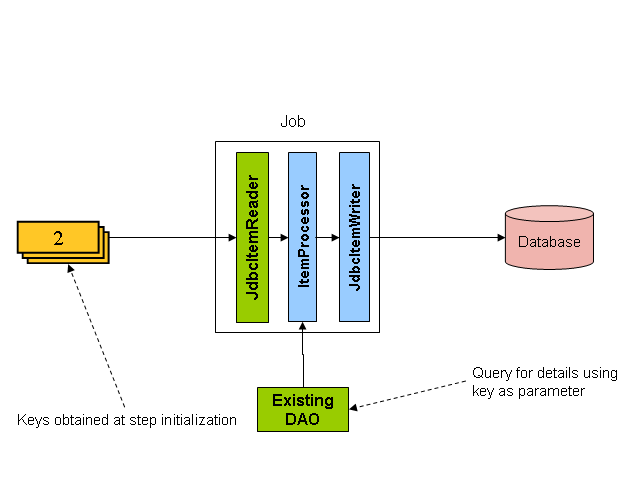

##11.4 基于ItemReaders的driving query

在readers 和writers章节中对数据库分页进行了讨论,很多数据库厂商,比如DB2,如果读表也需要使用的在线应用程序的其他部分,悲观锁策略,可能会导致问题.此外,打开游标在超大数据集可能导致某些供应商的问题.因此,许多项目更喜欢使用一个'Driving Query'的方式读入数据.这种方法是通过遍历keys,而不是整个对象,因此需要返回对象,如以下示例所示:

如您所见,这个例子使用一样的“FOO”表中使用基于指针的例子.然而,不是选择了整个行,只选择了ID的SQL语句.因此,返回一个整数,而不是返回FOO对象.这个数字可以用来查询的'details',这是一个完整的Foo对象:

ItemProcessor应该用转换的key从driving query得到一个完整的'Foo'对象,现有的Dao可以用查询完整的基于key的对象
